### 2025 React

##### 一，创建 react 脚手架

```js
命令 npx create-react-app 项目名称
package.json文件配置
  "name": "2025_react",
  "version": "0.1.0",
  "private": true,
  "dependencies": {
    "web-vitals": "^2.1.4" // 性能检测工具
  },
  "scripts": {
    "start": "react-scripts start", // 开发环境
    "build": "react-scripts build", // 生产环境
    "test": "react-scripts test", // 单元测试
    "eject": "react-scripts eject" // 暴露webpack配置规则
  },
  "eslintConfig": { // 词法检测 },
  "browserslist": { // 基于 browserslist 规范，这只浏览器的兼容兼容情况
    "production": [
      ">0.2%", // 使用率超过 0.2% 的浏览器
      "not dead", // 不考虑 IE
      "not op_mini all" // 不考虑欧朋浏览器
    ],
  }

命令 treer -i "node_modules" 获取项目文件树
├─package-lock.json
├─package.json
├─README.md
├─文档
| └React.md
├─src
|  └index.js
├─scripts
|    ├─build.js  							后期执行相关打包命令的入口文件
|    ├─start.js
|    └test.js
├─public
|   ├─favicon.ico
|   └index.html
├─config
|   ├─env.js
|   ├─getHttpsConfig.js
|   ├─modules.js
|   ├─paths.js                              打包中需要的一些路径
|   ├─webpack.config.js					 	webpack 配置
|   ├─webpackDevServer.config.js 			webpack-dev-serve配置
|   ├─webpack
|   |    ├─persistentCache
|   |    |        └createEnvironmentHash.js
|   ├─jest
|   |  ├─babelTransform.js
|   |  ├─cssTransform.js
|   |  └fileTransform.js
```

##### 二，配置 less less-loader 插件

```js
npm i less less-loader@8
在webpack.config.js配置less less-loadder插件
找到原来 sass 处理器位置修改成 less
1. const sassRegex = /\.(scss|sass)$/;
   const sassModuleRegex = /\.module\.(scss|sass)$/;
   替换
   const lessRegex = /\.less$/;
   const lessModuleRegex = /\.module\.less$/;
2. 找到 webpackEnv 函数，找到 module 模块
   sassRegex
   sassModuleRegex
   'sass-loader'
   替换
   lessRegex
   lessModuleRegex
   'less-loader'
```

##### 三，配置路径别名 @

```
找到 webpackEnv 函数，找到 resolve 模块里面的 alias 对象，添加 '@':paths.appSrc
```

##### 四，修改启动域名和端口号

```js
在 start.js 文件中找到
	const DEFAULT_PORT = parseInt(process.env.PORT, 10) || 3000;
	const HOST = process.env.HOST || '0.0.0.0';
	替换
	const DEFAULT_PORT = parseInt(process.env.PORT, 10) || 8080;
	const HOST = process.env.HOST || '127.0.0.1';

通过环境变量修改
下载插件 npm i cross-env
在package.json文件找到 scripts 启动命令处
	"start": "node scripts/start.js",
	替换
	"start": "cross-env  PORT=8080 node scripts/start.js",
```

##### 五，修改浏览器兼容

```js
在 index.jsx 入口文件添加
	import 'react-app-polyfill/ie9';
	import 'react-app-polyfill/ie11';
	import 'react-app-polyfill/stable';
兼容 ie9 ie11 stable
```

##### 六，配置跨域代理

```js
在 src 目录下创建 setUpProxy.js 文件
下载插件 http-proxy-middleware

1. http-proxy-middleware2.0写法

const { createProxyMiddleware } = require('http-proxy-middleware');
module.exports = function (app) {
    app.use(
        createProxyMiddleware("/jian", {
            target: "https://www.jianshu.com/asimov",
            changeOrigin: true,
            ws: true,
            pathRewrite: { "^/jian": "" }
        })
    )
    app.use(
        createProxyMiddleware("/zhi", {
            target: "https://new-at.zhihu.com/api/4",
            changeOrigin: true,
            ws: true,
            pathRewrite: { "^/zhi": "" }
        })
    )
}

2. http-proxy-middleware3.0写法

const { createProxyMiddleware } = require('http-proxy-middleware');
module.exports = function (app) {
    app.use(
        '/jian',
        createProxyMiddleware({
            target: 'https://www.jianshu.com/asimov',
            changeOrigin: true,
            pathRewrite: { '^/jian': '' }
        })
    );
    app.use(
        '/zhi',
        createProxyMiddleware({
            target: 'https://new-at.zhihu.com/api/4',
            changeOrigin: true,
            pathRewrite: { '^/zhi': '' }
        })
    );
}
```

##### 七，React，Vue，Anglar(NG)

```js
主流思想：
	不直接操作 DOM ，数据驱动视图更新
	数据发生改变时，页面会刷新
		构建了一套虚拟 DOM 到真实 DOM 的渲染体系
		有效的避免了 DOM 的重排和重绘
	操作 DOM 比较消耗性能(可能会导致重排重绘)

React框架采用的是 MVC 体系，Vue框架采用的是 MVVM 体系
```

##### 八，MVC

```js
MVC: model数据层 + view视图层 + controller控制层
	数据层受到改变，那么试图层则会刷新页面，试图层操作数据使得数据改变，根据需要更新数据层和试图层，作为数据层和试图层之间的桥梁，数据驱动视图来渲染，单向数据驱动
```


##### 九，MVVM

```js
MVVM：model数据层 + vew视图层 + viewModel数据/视图监听层
	不管数据层还是视图层发生改变，都会通知另一方，数据驱动视图来渲染，视图也可以驱动数据来更改，双驱动
```


##### 十，JSX 构建视图

```js
JSX：javaScript and html（xml）把 js 和 HTML 标签混合在一起，JSX 可以同时写 js 表达式和 HTML 标签

{number/string} : 值是啥，渲染啥
{boolean/undefined/null/Symbol/BigInt} : 空
{对象/正则/日期对象/函数} : 不支持
{数组} ： 渲染数组中的每一项

行内样式：需要基于对象格式处理，样式属性基于驼峰命名法
样式类名：class 替换成 className
注释：  {/*  */}


```

##### 十一，JSX 底层处理机制

```jsx
1. 把我们编写的 JSX 语法，编译成为虚拟 DOM 对象(virtualDOM: 框架内部构建的一套对象体系，对象属性描述出视图中 DOM 节点的相关特征)
	@1 基于 bael-peset-react-app 把 JSX 语法编译成React.createElement(...)格式
	@2 再把 createElement 方法执行，创建虚拟 DOM
		JSX语法
		<div id="app">
        	Hello, <span>world!</span>
      	</div>
		转换
		React.createElement(
			'div',
			{
         		id: 'app',
      		},
      		 "Hello,",
         	React.createElement("span",null，world!)
		)
		React.createElement函数：
			参数1 ele：元素标签(组件)名称
			参数2 props：元素属性对象，没有则为null
			参数3以及后面参数 ...chilren：元素  子节点
		React.createElement返回值：虚拟 DOM 对象(4个属性)
			key: 循环渲染所需要的key
			props: 存放本身的属性和以及所有子节点cjildren
			ref: 节点或组件实例
			type: 标签名称

		// 手写 createElement方法 创建虚拟 DOM 对象
 		export function createElement(ele,props,...children){
    		let virtualDom = {
        		$$typeof:Symbol('react.element'),
        		type:null,
        		props:{},
        		ref:null,
        		key:null,
    		}
    		let len = children.length
    		virtualDom.type = ele;
    		if(props !== null){
        		virtualDom.props = {
            		...props
        		};
    		}
    		if(len === 1) virtualDom.props.children = children[0]
    		if(len > 1) virtualDom.props.children = children;
    		return virtualDom
		}

2. 把构建的 virtualDOM 渲染为真实 DOM(真实DOM: 浏览器页面，最后渲染，用户看见的 DOM 元素)
	React16版本：
		React.render(
    		<>...</>,
        	documen.getElementById('root')
    	)
	React18版本：
		const root = ReactDOM.createRoot(document.getElementById('root'));
		root.render(
			<>...</>
		)

	// 手写 render 方法 把虚拟 DOM 转换成真实 DOM 16版本
	export function render(virtualDom,container){
    	let { type ,props } = virtualDom;
    	if(typeof type === 'string'){
        	// 动态创建对应标签
        	let ele = document.createElement(type);
        	//  为标签设置属性和节点
        	each(props,(value,key)=>{
            	// clssName的处理
            	if(key === 'className'){
                	ele.className = value;
                	return;
            	}
            	// 样式的处理
            	if(key === 'style'){
                	each(value,(val,attr)=>{
                    	ele.style[attr] = val;
                	})
                	return;
            	}
            	// 子节点处理
            	if(key === 'children'){
                	let children = value;
                	if(Array.isArray(children.length)) children = [children];
                	children.forEach(child=>{
                    	// 子节点是文本节点
                    	if(/^(string|number)$/.test(typeof child)){
                        	ele.appendChild(document.createTextNode(child))
                    	}
                    	// 子节点是虚拟 DOM 递归
                    	render(child,ele)
                	})
                	return;
            	}
            	ele.setAttribute(key,value)
        	})
        	// 把新增的标签，增加到指定容器中
        	container.appendChild(ele)
    	}
	}

补充说明: 第一次渲染页面是这直接从虚拟DOM转为真实DOM，但后期更新时，需要使用diff算法对比新旧DOM的差异部分，然后重新渲染差异部分
```


##### 十二，封装简单对象迭代方法

```js
	// 对象迭代方法 获取对象所有的 私有的，不论是否可枚举，不论类型
	// Object.getOwnPropertyNames() 获取对象非 Symbol 类型的私有属性(无关可枚举型)
	// Object.getOwnPropertySymbol() 获取 Symbol 类型的私有属性
	// 获取所有的私有属性：
	// let Keys = Object.getOwnPropertyNames(arr).concat(Object.getOwnPropertySymbol(arr))
	// 或 let keys = Reflect.ownKeys(arr) 不兼容 IE
	export function each(obj,callback){
    	if(obj === null || typeof obj !== 'object') throw TypeError('obj is not a object');
    	if(typeof callback !== 'function') throw TypeError('callback is not a function');
    	let keys = Reflect.ownKeys(obj);
    	keys.forEach(key =>{
        	let value = obj[key];
        	// 每次迭代都把回调函数执行
        	callback(value,key)
    	})
	}
```

##### 十三，函数组件底层渲染机制

```jsx
1. 基于 bael-peset-react-app 把调用的组件转换成 createElement 格式
2. 再把 createElement 方法执行，创建虚拟 DOM
	React.createElement(DemoOne,{
  		title:"demo",
  		x:10,
  		className:"demo",
  		style:{
    		fontSize: "20px"
  		}
	})
	转换成虚拟 DOM 对象
	{
		$$typeof:Symbol(react.element),
        key:null,
        ref:null,
        props:{ title: "demo",
          x: 10,
          className: "demo",
          style: {
            fontSize: "20px"
          }},
        type:DemoOne
	}
3. 通过 render 方法把虚拟 DOM 变成真实 DOM
	@1 转换过程中会把函数执行
	@2 把虚拟 DOM 的 props 作为实参传递给函数
	@3 最后把函数执行的返回结果基于 render 方法转为真实 DOM
```

##### 十四，函数组件 props 属性相关细节处理

```js
只读，不可修改
	对象本身可设置规则：冻结，密封，不可扩展
	冻结：
		Object.freeze(obj): 无法修改，无法新增，无法删除以及无法做劫持，冻结只是浅冻结，无法做到深度冻结，需要递归
		Object.isFrozen(obj): 检查是否被冻结

	密封：
		Obect.seal(obj): 可法新增，无法删除以及无法做劫持，密封只是浅密封，无法做到深度密封，需要递归
		Obect.isSealed(obj): 检查是否被密封

	不可拓展：
		Object.preventExtensions(obj): 可修改，可删除，可劫持，无法新增，也是浅不可拓展
		Object.isExtensible(obj): 检查是否不可拓展


设置 props 属性规则：
	下载插件 prop-types
	import PropTypes from 'prop-types';

	函数组件.propTypes = {
		// 类型：字符串，必传
    	key: PropTypes.string.isRequired,
    	// 类型：数字，不必传
    	key: PropTypes.number
	}
```

##### 十五，函数组件的插槽机制

```js
使用 props.children

默认插槽
	子组件：
		function Son(props) {
  			return (
    			<>
      				{props.children}
    			</>
  			)
		}
		export default Son
	父组件：
		import Son from "./Son";
		function Father() {
  			return (
    			<>
      				<Son>
        				<div>123</div>
      				</Son>
      				<Son>
        				<div>123</div>
        				<div>456</div>
      				</Son>
    			</>
  			)
		}
		export default Father

对 props.children 判断拆改使用：
	使用 React.Children 内置方法转为数组
	import React from 'react'
	function Son(props) {
    // 使用 React.Children 内置方法转为数组
   	let children =  React.Children.toArray(props.children);
  		return (
    		<>
      			{props.children}
      			<div>
        			{children[0]}
        			<br/>
        			{children[1]}
        			<br/>
      			</div>
    		</>
  		)
	}
	export default Son

具名插槽：
	子组件：
		import React from 'react'
		function Son(props) {
    		let children = React.Children.toArray(props.children);
    		let header = [];
    		let footer = [];
    		let defaults = [];
    		children.forEach(i=>{
        		if(i.props.slot === 'header'){
            		header.push(i)
        		}else if(i.props.slot === 'footer'){
            		footer.push(i)
        		}else{
            		defaults.push(i)
        		}
    		})
    		return (
        		<>
            		<div>
                		{header}
                		{footer}
                		{defaults}
            		</div>
        		</>
    		)
		}
		export default Son
	父组件：
		import Son from "./Son";
		function Father() {
  			return (
    			<>
      				<Son>
        				<div slot='footer'>页脚</div>
        				<span>哈哈</span>
        				<div slot='header'>页眉</div>
      				</Son>
    			</>
  			)
		}
		export default Father
```

##### 十六，静态组件和动态组件

```js
函数组件是“静态组件”：
	第一次渲染组件，把函数执行
	产生一个私有的上下文
	把解析出来的props(含children)传递进来(但是被冻结了)
	对函数返回的 JSX 元素虚拟 DOM 进行渲染
	但我们去修改数据的时候
	修改上级上下文的变量
	私有变量会发生改变
	但是视图不会更新

类组件和 HooKs 组件是“动态组件”
	render 函数在渲染的时候，如果 type 是 new 开头的，则会用 new 创建一个类的实例执行，也会把 props 传递进去
```

##### 十七，浅比较和深比较

```js
浅比较：
	const isObject = (obj) => {
    	return obj !== null &&  /^(object|function)$/.test(typeof obj)
	}
	const shallowEqual = (A,B)=>{
    	if(!isObject(A) && !isObject(B)) return A === B;
    	if(A === B) return true;
    	// 先比较成员的数量
    	let keysA = Reflect.ownKeys(A);
    	let keysB = Reflect.ownKeys(B);
    	if(keysA.length !== keysB.length) return false;

    	for(let i = 0; i< keysA.length; i++){
        	let key = keysA[i];
        	// 属性不在两个对象中 或者 属性名相同，属性值不同
        	if(!B.hasOwnProperty(key) || A[key] !== B[key]) return false
    	}
    	// 都相同返回true
    	return true
	}

深比较：
	const deepEqual = (A, B) => {
    	// NaN 对比情况判断为相同
    	if (Number.isNaN(A) && Number.isNaN(B)) return true;
    	// 是否为对象
    	if (!isObject(A) && !isObject(B)) return A === B;
    	if (A === B) return true;
    	// 先比较成员的数量
    	let keysA = Reflect.ownKeys(A);
    	let keysB = Reflect.ownKeys(B);
    	if (keysA.length !== keysB.length) return false;

    	for (let i = 0; i < keysA.length; i++) {
        	let key = keysA[i];
        	// 属性不在两个对象中 或者 属性名相同，属性值不同
        	if (!B.hasOwnProperty(key)) return false
        	// 递归比较
        	if (B.hasOwnProperty(key)) {
            	const equal = deepEqual(A[key], B[key])
            	if(!equal) return equal
        	}
    	}
    	// 都相同返回true
    	return true
	}
```

##### 十八，React 合成事件

```js
React 内部基于浏览器合成的事件，在合成事件中 React 提供统一的事件对象，兼容了浏览器的差异，通过根 root 根元素顶层监听的形式，通过事件委托的方式来统一管理所有的事件，可以在事件上区分事件的优先级，优化用户体验

事件具备传播机制：
	1. 从最外层向最里层逐一查找（捕获阶段：分析路径）
	2. 把事件源（出发事件的元素）的行为触发（目标阶段）
	3. 按照捕获阶段分析出来的路径，从里到外，把每一个元素相同的事件行为触发（冒泡阶段）

	阻止事件传播的两个方法
	ev.stopPropagation():阻止事件的从传播（包括捕获和冒泡）
	ev.stopImmediateProgation():也可以阻止事件传播，只不过它可以把当前元素绑定其他方法（同级的），如果还未执行，也不会再执行了


事件委托：
	利用事件的传播机制，实现一套事件绑定处理方案

	优势：
	提高 JS 代码的运行性能，实现一套事件绑定处理方案
	在一定的需求上需要基于事件委托
	给动态绑定的元素做事件绑定


React 两种绑定事件的方式以及区别：
	1. onXxx : 绑定在冒泡阶段
	2. onXxxCapture : 绑定在捕获阶段
	一个元素同时用这个两个绑定一个事件时，优先执行第二种

合成事件：
	绝对不是给当前元素基于 addEventKisener 单独做的事件绑定
	React 合成事件都是基于事件委托处理的
	在17版本及以后都是委托到 root 根容器（捕获和冒泡）
	在17版本以前都是委托 document 容器（只做了冒泡阶段的委托）
	只对有事件传播机制的事件做了委托

在组件渲染的时候，如果发现 JSX 元素中有 onXxx/onXxxCapture 这样的属性，不会给当前元素直接做事件绑定，只是把绑定的方法赋值给元素的相关属性

例如：
		xxx.onClick=()=>{}
		xxx.onClickCapture=()=>{}
	在元素上添加了属性为 xxx.onClick,属性值是一个事件
	然后对 #root 这个容器做事件绑定（捕获和冒泡都做了）
	原因：是因为组件中所有渲染的内容，最后都会插入到 #root 容器中，这样点击页面任何一个元素，最后都会 #root 的事件中触发

```

##### 十九，合成事件执行原理

```js
结构：
		const root = document.getElementById('root');
        const secondFloor = document.getElementById('secondFloor');
        const thirdFloor = document.getElementById('thirdFloor');

运行逻辑：
        secondFloor.onClick = () => {
            console.log('secondFloor冒泡');
        }
        secondFloor.onClickCapture = () => {
            console.log('secondFloor捕获');
        }

        thirdFloor.onClick = () => {
            console.log('thirdFloor冒泡');
        }
        thirdFloor.onClickCapture = () => {
            console.log('thirdFloor捕获');
        }
        // 捕获
        root.addEventListener('click', (ev) => {
            let path = ev.composedPath();
            [...path].reverse().forEach(el => {
                if (el.onClickCapture) {
                    el.onClickCapture();
                }
            })
        }, true)
        // 冒泡
        root.addEventListener('click', (ev) => {
            let path = ev.composedPath();
            [...path].forEach(el => {
                if (el.onClick) {
                    el.onClick();
                }
            })
        }, false)

当 render 方法将虚拟 DOM 转换成真实 DOM 时，会将所有属性添加在标签上，
那么当标签触发事件时就会通过事件流触发事件的捕获和冒泡阶段，
当捕获和冒泡到根节点时，根节点会通过事件对象中的 composedPath 方法获取到路径
ev.composedPath()得到一个数组，
当捕获时会将数组反转，然后遍历判断是否存在 onXxx/onXxxcapture 这两个属性值，存在则执行，冒泡同理但不需要反转数组
```


##### 二十，Hook 组件

```
Hooks组件是 React16.8 后开始提供的
```

##### 二十一，安装 antd，配置中文包

```jsx
安装命令 npm i antd

配置中文以及配置日历中文，需要安装 dayjs
安装命令 npm i dayjs

在入口文件配置
	import React from 'react';
	import ReactDOM from 'react-dom/client';
	import '@/index.css';
	import App from '@/App';
	import { ConfigProvider } from 'antd';
	import zhCN from 'antd/locale/zh_CN';
	import "dayjs/locale/zh-cn";

	const root = ReactDOM.createRoot(document.getElementById('root'));

	root.render(
  		<ConfigProvider locale={zhCN} >
    		<App />
  		</ConfigProvider>,
	);

```

##### 二十二，useState

```js
Hooks 组件每次更新视图：
	都是把函数重新执行一次，会产生全新私有上下文
	内部的代码都需要重新执行一次

useState 更新过程：
	首先 Hooks 组件会创建两个去全局变量，一个空数组，一个索引初始值为0
	当我们每次调用 useState 的时候，
	执行过程中 useState 会把当前索引值存储下来，
	再储存当前索引值下，传递进来的状态，
	如果接收的值是执行函数就会执行函数，把函数返回值重新赋值给接收的形参，
	然后创建修改状态的方法，
	再对全局索引加 1，最后返回当前索引下的状态以及更新状态方法
	调用修改状态方法，可以传值也可以传回调函数
	执行的时候首先会判断形参是否是一个函数，是函数就执行，
	把函数的返回值重新赋值给形参，再根据保存下来的索引值，
	然后通过 Object.is 方法判断新的状态值和旧的状态值是否相同
	不同则更新数组对应的状态，然后再一部通知渲染视图

当调用 useState 返回的修改状态方法后，后面接着输出的状态值还是旧的值，因为找到的变量是它的上级上下文

useState 返回的修改状态的方法：
	在 React18 中异步的，会有一个更新队列，实现状态的批量处理，队列所有的状态行函数执完成后刷新视图
	//执行一次
    const handle = ()=>{
    	setXXX(XXX)
        setXXX(XXX)
    }

    在 React-dom 中有一个 flushSync 方法可以改变成同步的
    // 执行两次
    const handle = ()=>{
    	flushSync(()=>{
        	setXXX(XXX)
        })
        setXXX(XXX)
   	}

   	在 React16 中可以放在定时器里面执行变成同步的
   	// 执行两次
   	setTimeout(()=>{
    	setXXX(XXX)
        setXXX(XXX)
    },1000)

useState 修改状态值后拿到最新的值 2 种常见方法
	1. 用 useEffect
	2. 调用状态修改方法传回调函数
		setXxx((v)=>{
			let newVal = v+1
			return newVal
		})
```


##### 二十三，useState 优化机制

```js
useState 修改状态方法在循环 for/in中使用 flushSync, 不管循环几次，hooks 组件都会执行两次
	如果不使用 flushSync 则只会执行一次
	原因：
		因为每次 useState 每次修改状态值的时候都会把修改的值与原来的值做比较（基于Object.is方法），当他发现修改的值与原来的值相同则不会重新执行 hooks 组件

	但是 setXxx 参数接收的是一个函数，那么使用 flushSync, hooks 组件则会执行循环的次数，如果不使用 flushSync 也只是执行一次，但是最后得到的状态值不相同

都不使用 flushSync 情况下
	// hooks 组件执行一次, x 输出为 2
	let [x, setX] = useState(1);
    const handle = () => {
        for (let i = 1; i < 10; i++) {
        	 setX(x + 1);
        }
    }

    // hooks 组件执行一次, x 输出为 11
	let [x, setX] = useState(1);
    const handle = () => {
        for (let i = 1; i < 10; i++) {
        	 setX((v)=>{
        	 	return v + 1
        	 });
        }
    }

都使用 flushSync 情况下、
	//  hooks 组件执行两次, x 输出为 2
	let [x, setX] = useState(1);
    const handle = () => {
        for (let i = 1; i < 10; i++) {
            flushSync(() => {
                setX(x + 1);
            });
        }
    }

    // hooks 组件执行十次, x 输出为 11
    let [x, setX] = useState(1);
    const handle = () => {
        for (let i = 0; i < 10; i++) {
            flushSync(() => {
                setX((v) => {
                    return v + 1;
                });
            });
        }
    }
```


##### 二十四，手写 useState hooks 函数

```js
// 模拟一个简单useState

/**
 * _state:储存状态
 * _index:状态索引值
 */

let _state = [],
    _index = 0;

//  通知视图更新
let defer = (cb) => Promise.resolve().then(cb);

export function UseState(initialState) {
    // 储存对应的索引值
    let currentIndex = _index;
    // 如果为函数，则执行函数，返回值赋值给形参
    if (typeof initialState === 'function') {
        initialState = initialState();
    }
    // 储存当前索引下的状态
    _state[currentIndex] = initialState;
    let setState = (newState) => {
        // 如果是函数，将当前索引下的状态作为实参传入并执行函数，将返回值赋值给形参
        if (typeof newState === 'function') {
            newState = newState(_state[currentIndex]);
        }
        // 通过Object.is方法判断前后状态是否相等，不相等则更新状态并通知视图更新
        if (!Object.is(_state[currentIndex], newState)) {
            _state[currentIndex] = newState;
            defer(() => {
                // 通知视图更新
                console.log('视图更新');
            })
        }
    }
    // 索引值 + 1
    _index += 1;
    // 返回一个数组，第一个元素为当前索引下的状态，第二个元素为更新状态的方法
    return [_state[currentIndex], setState];
}
```

##### 二十五，useEffect

```js
useEffect 函数可以接收 2 参数
	参数 1 ： 回调函数
	参数 2 ： 数组（可以不传），数组里面是依赖的状态

useEffect(()=>{
	会在 hooks 组件任何时候执行
})

useEffect(()=>{
	会在 hooks 组件第一次加载时执行
}，[])

useEffect(()=>{
	会在 hooks 组件第一次加载时执行，同时依赖的状态发生变化时执行
}，[状态])

useEffect(()=>{
	return ()=>{
		可以获取上一次的状态值
		返回的函数会在组件释放的时候执行
	}
})

useEffect(()=>{
	return ()=>{
		返回的函数在组件卸载时执行
	}
}，[])

useEffect(()=>{
	return ()=>{
		返回的函数在依赖的状态发生变化以及组件卸载时执行
	}
}，[状态])
```

##### 二十六，useEffect 执行原理以及细节

```js
执行原理：
	在 hooks 函数第一次执行时，
    hooks 函数所有的 useEffect 都会被 React 内部的一个 MountEffect 方法把所有的 useEffect 的回调函数以及依赖放进一个 effect 链表中，
    当视图渲染完毕后，又会通过 React 内部的一个 UpdateEffect 方法通知链表中所有的回调函数按要依赖求执行，
    如果 useEffect 的回调函数返回的是一个函数，那么这个被返回的函数会在 hooks 组件释放前执行
    
细节：
	useEffect 函数只能在 hooks 函数下调用
    useEffect 的返回值必须是一个函数，所有回调函数不能是 async 函数
    useEffect 必须在函数的最外层的上下文中调用，不能把其嵌入到条件判断，循环等操作语句当中
```


##### 二十七，useLayoutEffect

```js
与 useEffect 运行原理基本一致
	useLayoutEffect 会比 useEffect 更早
   	会阻止浏览器渲染真实 DOM，优先执行 effect 链表中的回调函数
    useEffect 不会阻止浏览器渲染真实 DOM
    在两者的回调函数中，都可以获取真实 DOM
```


##### 二十八，useRef 与 React.forwardRef 以及 useImperativeHandle

```js
useRef 和 React.createRef 区别
	1. useRef 在 hooks 组件二次更新的时候获取的是之前的 DOM ，不会重复获取
	2. React.createRef 在 hooks 组件二次更新的时候会重新获取 DOM
   
useRef 配合 React.forwardRef 获取子组件元素，直接使用 useRef 在子组件上会报错
	子组件：
    	const Son = React.forwardRef(function Son(props, ref) {
    		return (
       			<>
            		<span ref={ref}>子组件</span>
        		</>
    		)
		})
    父组件：
    	function Father() {
  			let n = useRef()
  			return (
    			<>
      				<Son ref={n}></Son>
    			</>
  			)
		}

useRef 配合 React.forwardRef 以及 useImperativeHandle 完成子父组件传参
	子组件：
    	const Son = React.forwardRef(function Son(props, ref) {
    		let [text, setText] = useState('');
    		useImperativeHandle(ref, () => {
        		return {
            		// 返回的内容，可以被父组件的 ref 对象获取
            		text,
            		setText
        		}
    		})
    		return (
        		<>
            		<span ref={ref}>子组件</span>
        		</>
    		)
		})
    父组件：
    	function Father() {
  			let n = useRef()
  			return (
    			<>
      				<Son ref={n}></Son>
    			</>
  			)
		}
        
React.forwardRef用法：
	参数1：一个 Hooks 组件，Hooks 组件可以多接收到一个 Ref
    const Son = React.forwadrRef((props,ref)=>{
 		return <></>
 	})
    
useImperativeHandle用法：
	参数1：接收到的Ref，参数2：回调函数，返回值为想要暴露给父组件的属性和方法
    const Son = React.forwardRef(function Son(props, ref) {
    	useImperativeHandle(ref, () => {
        	return {
            	属性和方法
        	}
    	})
    	return <></>
	})
```

##### 二十九，useMemo

```js
useMemo 使用：
	参数1：回调函数，参数2：依赖项（数组）
    
    组件第一次渲染时 useMome 的回调函数会自动执行一次，
    后期只有依赖项发生变化时，useMemo 回调函数才会自动执行，
    如果依赖项意外的状态数据发生变化，
    导致视图更新组件重新调用，useMemo 回调函数不会执行，
    useMemo 回调返回一个通过计算的值
    
    let [x, setX] = useState(10),
        [y, setY] = useState(10)

    let num = useMemo(() => {
        return x + y
    }, [x, y])
```

##### 三十，useCallback 和 memo

```js
useCallback 使用：
	参数1：回调函数，参数2：依赖项（数组）
	组件第一次渲染时 useCallback 的回调函数会自动执行一次，
    后期只有依赖项发生变化时，useCallback 回调函数才会自动执行，
    如果依赖项意外的状态数据发生变化，
    导致视图更新组件重新调用，useCallback 回调函数不会执行，
    useCallback 回调函数返回一个未执行的函数，
    不是所有的函数都需要 useCallback 处理，
    一般都是传给子组件的方法做处理，
    这样做就不会导致子组件也被重新渲染
    
注意：
	useCallback 没有设置任何依赖，
    则函数永远在第一次组件渲染，产生的闭包中创建，
    函数中用到的信息也是第一次闭包中的信息
    
    子组件只有 x 的状态值发生变化时，子组件才会刷新：
    子组件：
    	const Son = memo(
    		function Son(props) {
        		console.log('子组件')
        		return (
            		<>
                		<span>子组件</span>
            		</>
        		)
    		}
		)
    	
    父组件：
    	function Father() {
  			let [x, setX] = useState(10),
    			[y, setY] = useState(10)

  			const handleClick = useCallback(() => {
  			}, [x])
  			return (
    			<>
      				<Button onClick={() => setX(x + 1)} >点击x</Button>
      				<Button onClick={() => setY(y + 1)} >点击y</Button>
      				<Son handleClick={handleClick} ></Son>
    			</>
  			)
		}
```

##### 三十一，memo 和 forwaordRef

```js
memo 和 forwardRef 一起使用：
	const Son= forwordRef((props,ref)=>{
        return <>我是子组件</>
    })
    export default memo(Son)
```

##### 三十二，自定义封装 Hooks

```js
封装 Hooks 函数 

基于 useState 二次封装：
// 可以单独更新对象或者数组内某一元素 或者 整个更新
export const UseAllState = (val) => {
    let [state, setState] = useState(() => {
        return val === "function" ? val() : val
    })
    
    const setObjState = (attr, newVal) => {
        if (typeof attr === "function") {
            return attr = attr()
        }
        if (newVal && typeof newVal === "function") {
            return newVal = newVal()
        }

        setState((pre) => {
            if (typeof attr === "number" && newVal && Object.prototype.toString.call(state).includes("Array")) {
                if (state.hasOwnProperty(attr)) {
                    state[attr] = newVal
                    return [...pre, ...state]
                }
            }
            else if (typeof attr === "string" && newVal && Object.prototype.toString.call(state).includes("Object")) {
                if (state.hasOwnProperty(attr)) {
                    return { ...pre, [attr]: newVal }
                }
            } else if (Object.prototype.toString.call(attr).includes("Object")) {
                return { ...pre, ...attr }
            } else if (Object.prototype.toString.call(attr).includes("Array")) {
                return attr
            } else {
                return attr
            }
        })
    }
    return [state, setObjState]
}

组件第一次渲染，统一操作
export const UseDidMount = (val) => {
    useEffect(() => {
        console.log('组件第一次渲染')
    }, [])
}


自定义 Hooks 作用：
	主要提取一些公共的逻辑，加以复用，省去冗余代码
```

##### 三十三，useContext

```js
useContext 用法：
	1. 创建一个 js 文件
	import React from 'react';
	const ContextObject = React.createContext();

	export default ContextObject;
	
	2. 用法
    // 祖先组件
    import React, { useState } from 'react';
	import ContextObject from "@/utils/ContextObject";
	import Son from "./Son";
	const Father = () => {
  		let [x, setX] = useState(10),
    		[y, setY] = useState(10)

  		return (
    		<ContextObject.Provider
      			value={{
        			x,
        			y,
        			setX,
        			setY
      			}}
    		>
      		<div>祖先组件</div>
      		<Son ></Son>
    		</ContextObject.Provider>
  		)
	}
	export default Father
	
	// 子组件
	import React, { useContext } from 'react'
	import Grand from './Grand'
	import ContextObject from "@/utils/ContextObject";
	const Son = () => {
    	const { x, y, setX, setY } = useContext(ContextObject);
    	console.log(x, y, setX, setY, '子组件');
    	return (
        	<>
            	<span>子组件</span>
            	<Grand></Grand>
        	</>
    	)
	}
	export default Son

	// 孙组件
	import React, { useContext } from 'react';
	import ContextObject from "@/utils/ContextObject";

	const Grand = () => {
    	const { x, y, setX, setY } = useContext(ContextObject);
    	console.log(x, y, setX, setY, '孙组件');
    	return (
        	<>
            	<div>孙组件</div>
        	</>
    	);
	}
	export default Grand;
```

##### 三十四，样式私有化处理

```js
1. 内联样式
2. 类名唯一
3. css module(推荐)

	注意:className="xxx" 这样定义类名无法做样式嵌套，
    	className={style.xxx} 这样才可以做样式嵌套
        
 	创建样式文件: xxx.module.less / xxx.module.css / xxx.module.scss / xxx.module.sass
	
	.nav {
    	width: 100%;
    	height: 200px;
	}
	// 样式混入
	.fontSize16() {
    	font-size: 16px;
	}
	.box {
    	background-color: red;
    	.title {
            .fontSize16();
        	color: aqua;
    	}
	}
	// 样式穿透 
	:global {
    	.ant-btn {
        	color: salmon;
        	background-color: bisque;
    	}
	}
	
	// 引入使用
	import React from 'react';
	import style from './index.module.less';
	import { Button } from 'antd';
	const Nav = () => {
    	return (
        	<nav className={`${style.nav} ${style.box}`}>
            	<h2 className={style.title} >React</h2>
            	<Button type='primary'>Button</Button>
        	</nav>
    	);
	}
	export default Nav;

4. React-jss 插件
5. styled-components 插件
```

##### 三十五，高阶组件

```
高阶组件：
	利用 JS 中的闭包 （柯里化函数） 实现的组件化代理
好处：
	可以在调用组件的时候在返回的闭包中做一些其他逻辑操作
```

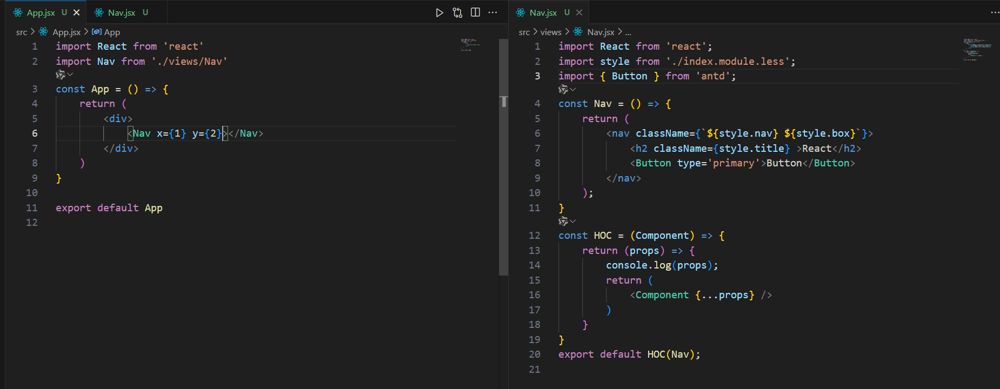

##### 三十六，Redux

```js
运行过程：
	1. 在创建的 store 容器中，存储两部分内容
		公共状态：各个组件需要共享 / 通信的信息
		事件池：存放一些方法（让组件可以更新的方法）
		
		特点：当公共状态发生改变，会默认立即通知事件池中的方法执行
			这些方法的执行，主要目的就是让指定的组件更新，而组件一更新
			就可以获取到最新的公共状态信息进行渲染！！
			
	2. 修改公共容器中的状态，不能直接修改
		基于 dispatch 派发，通知 reducer 执行
		在 reducer 中去实现状态更新
		
创建步骤： 
	1. 创建全局公共容器，储存各个组件需要的公共信息
		const store = createStore(reducer)
	2. 在组件内部获取公共状态信息，然后渲染
    	store.getState()
	3. 获取放在公共容器的事件池中的事件
    	store.subscibe()
	4. 创建容器对象的时候，需要传递 reducer
    	let inital={...} // 初始状态值
       	const reducer = (state=inital,action) =>{
            // state 容器的状态
            // action 派发的行为对象（必须具备 type 属性）
            switch(action.type){
            	// 根据传递的type值不同，修改不同的状态信息
            }
            // 返回的信息会替换容器的公共状态
            return state
        }
	5. 派发任务，通知 reducer 执行修改状态
    	store.dispatch({
            type:xxx,
            ....
        })
	6. 需要在根组件导入 Store, 放在上下文
	7. 安装 Redux 相关插件，安装命令：
    	npm i @reduxjs/toolkit redux redux-logger redux-promise redux-thunk
```

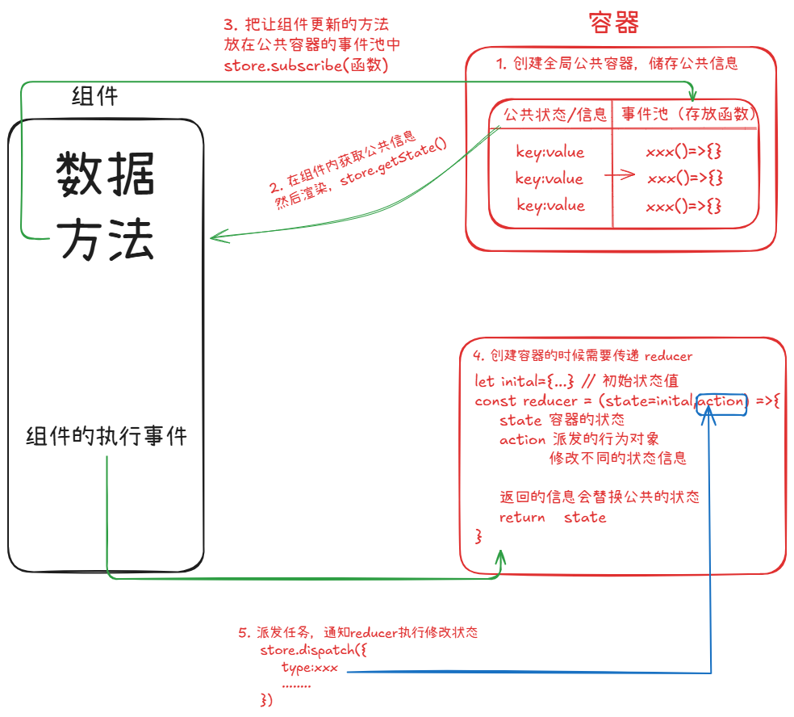

##### 三十七，创建并引入 Redux

```js
第一步：
	当创建 Redux 完成时，
    Redux 内部会主动调用 reducer 函数，会完成第一次执行，
    reducer 的 state 会拿到定义的初始值，会先克隆一份初始值，
    action 中的 type 属性值，Redux 内部会生成一个火星文，不会和任何逻辑匹配
    reducer 函数返回克隆值，
    后续 reducer 函数执行的时候，
    然后对克隆值做出修改，再返回出去
    
第二步：
	在入口文件导入 store,
   	并且创建全局上下文文件 ancestorsContext.js
	在入口文件中把 store 放进全局上下文
    最后在组件中调用
```

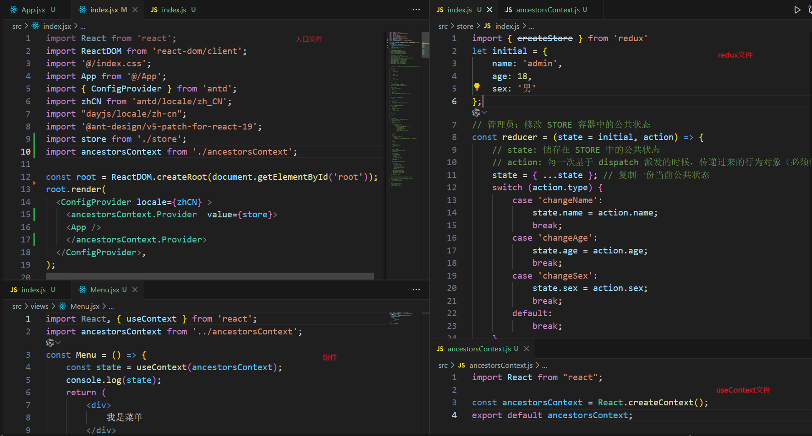

##### 三十八，使用 Redux

```js
第一步：
	在函数组件中引入全局上下文，
	并拿到 store 公共信息容器
	在调用 store.getState() 方法拿到公共信息
	
	import React, { useContext } from 'react';
	import ancestorsContext from '../ancestorsContext';
	const Menu = () => {
    	const state = useContext(ancestorsContext);
    	const { name, age, sex } = state.getState()
    	return (
        	<div>
            	<div>姓名：{name}</div>
            	<div>年龄：{age}</div>
            	<div>性别：{sex}</div>
        	</div>
    	);	
	}
	export default Menu;

第二步：
	实现修改公共信息刷新视图
    创建一个状态值，然后写一个改变状态值的方法，
    使用 store.subscribe() 把改变状态值的方法加入 store 事件池中
    store.subscribe() 返回一个方法 unsubscribe,
    调用 unsubscribe() 方法可以移出 store 事件池的事件
    
    import React, { useContext, useState, useEffect } from 'react';
	import ancestorsContext from '../ancestorsContext';
	const Menu = () => {
    	const state = useContext(ancestorsContext);
    	const { name, age, sex } = state.getState();
    	const [num, setNum] = useState(0);
    	const addNum = () => {
        	setNum(num + 1);
    	};
    	useEffect(() => {
        	let unsubscribe = state.subscribe(addNum);
    	}, [])
    	return (
        	<div>
            	<div>姓名：{name}</div>
            	<div>年龄：{age}</div>
            	<div>性别：{sex}</div>
        	</div>
    	);
	}
	export default Menu;

第三步：
	修改 store 的公共信息，
    调用 store.dispatch() 方法，必须传一个 type 值
    type 与 store 中的 switch 参数值相对应
    store.dispatch({type:xxxx})
    useEffect也需要做出调整来保证页面更新
    
    import React, { useContext, useState, useEffect } from 'react';
	import { Button } from 'antd'
	import ancestorsContext from '../ancestorsContext';
	const Menu = () => {
    	const state = useContext(ancestorsContext);
    	const { name, age, sex } = state.getState();
    	const [num, setNum] = useState(0);
    	const addNum = () => {
        	setNum(num + 1);
    	};
   		useEffect(() => {
        	let unsubscribe = state.subscribe(addNum);
        	return () => {
            	unsubscribe();
        	};
    	}, [num]);
    	// 修改姓名
    	const changeName = () => {
        	state.dispatch({
            	type: 'changeName',
            	name: '张三'
        	});
    	};
    	// 修改年龄
    	const changeAge = () => {
        	state.dispatch({
            	type: 'changeAge',
            	age: 20
        	});
    	}
    	// 修改性别
    	const changeSex = () => {
        	state.dispatch({
            	type: 'changeSex',
            	sex: '女'
        	});
    	}
    	return (
        	<div>
            	<div>姓名：{name}</div>
            	<div>年龄：{age}</div>
            	<div>性别：{sex}</div>
            	<Button onClick={changeName} >修改姓名</Button>
            	<Button onClick={changeAge} >修改年龄</Button>
            	<Button onClick={changeSex} >修改性别</Button>
        	</div>
    	);
	}
	export default Menu;

```

##### 三十九，Redux 部分源码

```js
创建一个 createStore 函数，
函数接收一个 reducer 对象
返回一个对象，对象有三个方法分别是：
	getState,dispatch,subcribe
首先判断 reducer 是不是一个函数，不是则抛出错误，
createStore 函数定义两个变量：
	state: 初始值，
    listeners: 数组，储存更新状态的事件（事件池）
然后再定义三个方法：
	getState,dispatch,subcribe

getState方法：
	调用时，只需返回 state
    
subcribe方法：
	接收一个参数
    调用时，需要判断参数是否是一个函数，不是则抛出错误，
    再判断 listeners 事件池中有没有把传进来的函数加进去，
    如果没有则加入事件池，调用时返回一个函数 unsubcribe
    调用 unsubcribe 会删除之前放在事件池的函数
    否则会因为 Hooks 函数的闭包原因无法拿到最新的更新状态方法
    
dispatch方法：
	接收一个参数
    调用时，需要判断接收的参数是不是一个对象，不是则抛出错误
    然后检查参数是否存在 type 属性，否则抛出错误，
    然后调用 reducer 方法，拿到reducer 方法的返回值更新 state 公共状态值，
    然后遍历 listenners 事件池执行里面的状态更新方法
    最后 dispatch 方法返回接收的参数
    
在调用 createStore 函数时，
内部会自行调用一次 dispatch 方法，
所以调用dispatch({type:"@@redux/INIT"+36位的随机数并转成36进制})

// 实现部分 Redux 功能
export function createStore(reducer) {
    let state; // 存储公共状态
    let listeners = []; // 存储事件池(让组件更新的状态)
    // 获取公共状态
    const getState = () => {
        return state;
    }
    // 向事件池中加入让组件更新的方法
    const subscribe = (listener) => {
        // 判断是否为函数
        if (typeof listener !== 'function') throw new Error('listener must be a function');
        // 如果没有添加过，则添加事件
        if (!listeners.includes(listener)) {
            listeners.push(listener);
        }
        // 返回一个从事件池中，移除方法的函数
        return () => {
            let index = listeners.indexOf(listener);
            if (index !== -1) {
                listeners.splice(index, 1);
            }
        }
    }
    // 派发任务通知 reducer 执行
    const dispatch = (action) => {
        // 校验规则
        if (!Object.prototype.toString.call(action) === '[object Object]') throw new Error('action must be an object');
        if (typeof action.type !== 'undefined') throw new Error('action.type must have a type property');
        // 执行 reducer，并获取新的状态
        state = reducer(state, action);
        // 遍历 listeners, 执行里面的状态更新方法
        listeners.forEach(listener => listener());
        return action;
    }
    // 自动执行一次 dispatch 方法, type 为 @@redux/INIT，
    // 源码中生成一个36位随机值，转成36进制
    dispatch({ type: '@@redux/INIT' });
    // 返回创建的 store 对象
    return {
        getState,
        subscribe,
        dispatch
    };
}
```

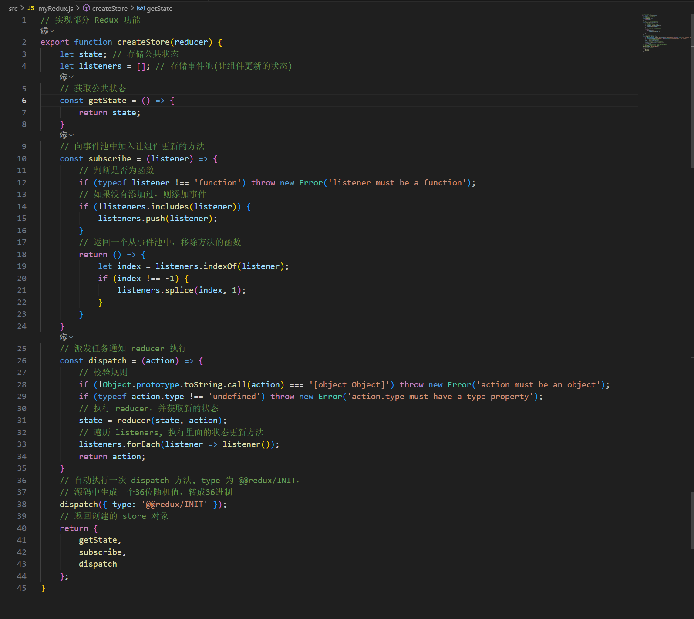

##### 四十，Redux 工程化

```js
在项目中会存在大量的组件化开发，
所以需要把 Redux 工程化，
把每个组件对应的 Reducer 拆开，
最后使用 Reducer 中的 combineReducers 合并起来

demo1.js 文件：
	let initial = {
    	...
	}
	const demo1 = (state = initial, action) => {
    	state = { ...state };
    	switch (action.type) {
        	case 'xxx':
            	...
    	}
    	return state;
	}
	export default demo1;
	
demo2.js 文件：
	let initial = {
    	...
	}
	const demo2 = (state = initial, action) => {
    	state = { ...state };
    	switch (action.type) {
        	case 'xxx':
            	....
    	}
    	return state;
	}
	export default demo2; 

reducer.js 文件
	import { combineReducers } from "redux";
	import demo1 from "./reducers/demo1";
	import demo2 from "./reducers/demo2";
	const rootReducer = combineReducers({
    	demo1,
    	demo2,
	});
	export default rootReducer;

redux.js 文件
	import { createStore } from 'redux';
	import reducer from './reducer';
	const store = createStore(reducer);
	export default store;
        
组件内部的修改公共状态方法不变
获取公共数据：
	state.getState().xxx 存储的对应数据对象
```

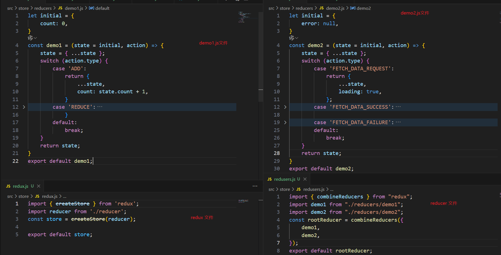

##### 四十一，Redux 创建以及对 Redux 工程化

```js
第一步：
	创建 Redux 并拆分 reducer ,而后合并 reducer：
    在 src 文件下创建 store 文件夹，在里面创建 index.js 文件
    // store/index.js
    import { createStore } from 'redux';
	import reducers from './reducers';

	const store = createStore(reducers);
	export default store;

	在 store 文件夹下创建 reducers 文件夹，里面创建 index.js 文件
    // store/reducers/index.js
    import { combineReducers } from "redux";
	import menu from "./menu";
	import nav from "./nav";
	const reducers = combineReducers({
    	menu,
    	nav,
	});
	export default reducers;

	在 reducers 文件夹下创建 menu.js 以及 nav.js 
	// store/reducers/menu.js
	import * as TYPE from './action-type'; // 导入type标识管理文件
	let initalState = {
    	name: 'admin',
    	age: 18,
    	sex: '男'
	}
	const menu = (state = initalState, action) => {
    	state = { ...state };
    	switch (action.type) {
        	case TYPE.MENU_SET_NAME:
            	state.name = action.payload;
            	break
        	case TYPE.MENU_SET_AGE:
            	state.age = action.payload;
            	break
        	case TYPE.MENU_SET_SEX:
            	state.sex = action.payload;
            	break
        	default:
            	break
    	}
    	return state;
	}
	export default menu;

	// store/reducers/nav.js
	import * as TYPE from './action-type'; // 导入type标识管理文件
	let initalState = {
    	work: '切图仔',
    	seniority: '1年',
    	wages: '3k'
	}
	const nav = (state = initalState, action) => {
    	state = { ...state };
    	switch (action.type) {
        	case TYPE.NAV_SET_WORK:
            	state.work = action.payload;
            	break
        	case TYPE.NAV_SET_SENIORITY:
            	state.seniority = action.payload;
            	break
        	case TYPE.NAV_SET_WAGES:
            	state.wages = action.payload;
            	break
        	default:
            	break
    	}
    	return state;
	}
	export default nav;

第二步：
	对每个 reducer 的 type 标识进行统一管理以免发生冲突：
    在 reducers 文件夹下创建 action-type.js 文件
    // store/reducer/action-type.js
    // menu组件
	export const MENU_SET_NAME = 'MENU_SET_NAME';
	export const MENU_SET_AGE = 'MENU_SET_AGE';
	export const MENU_SET_SEX = 'MENU_SET_SEX';

	// nav组件
	export const NAV_SET_WORK = 'NAV_SET_WORK';
	export const NAV_SET_SENIORITY = 'NAV_SET_SENIORITY ';
	export const NAV_SET_WAGES = 'NAV_SET_WAGES';
    
第三步：
	对每个修改的 action 方法进行管理
    在 store 文件下创建 actions 文件夹，在 actions 下创建 index.js menu.js nav.js
	// store/action/menu.js
	import * as TYPE from '../reducers/action-type'; // 导入type标识管理文件
	const menu = {
    	setName() {
        	return TYPE.MENU_SET_NAME;
    	},
    	setAge() {
        	return TYPE.MENU_SET_AGE;
    	},
    	setSex() {
        	return TYPE.MENU_SET_SEX;
    	},
	}
	export default menu; 

	// store/action/nav.js
	import * as TYPE from '../reducers/action-type'; // 导入type标识管理文件
	const nav = {
    	setWork() {
        	return TYPE.NAV_SET_WORK;
    	},
    	setSeniority() {
        	return TYPE.NAV_SET_SENIORITY;
    	},
    	setWages() {
        	return TYPE.NAV_SET_WAGES;
    	},
	}
	export default nav; 

	// store/actions/index.js
	import menu from './menu'
	import nav from './nav'

	export default {
    	menu,
    	nav
	}

最后在组件调用公共数据以及修改数据的方法
```

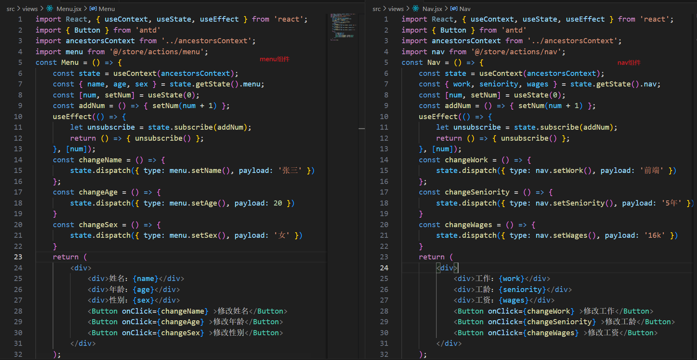

##### 四十二，手写 Redux 的 combineReducers 部分源码

```js
const myCombineReducers = (reducers) => {
    let reducersKeys = Reflect.ownKeys(reducers);
    // 返回一个合并后的 reducer
    return (state = {}, action) => {
        // 把 reducers 中的每一个 reducer(每个模块的reducer) 都执行一遍
        let netxState = {};
        reducersKeys.forEach((key) => {
            let reducer = reducers[key];
            netxState[key] = reducer(state[key], action)
        })
        return netxState;
    }
};
export default myCombineReducers;
```

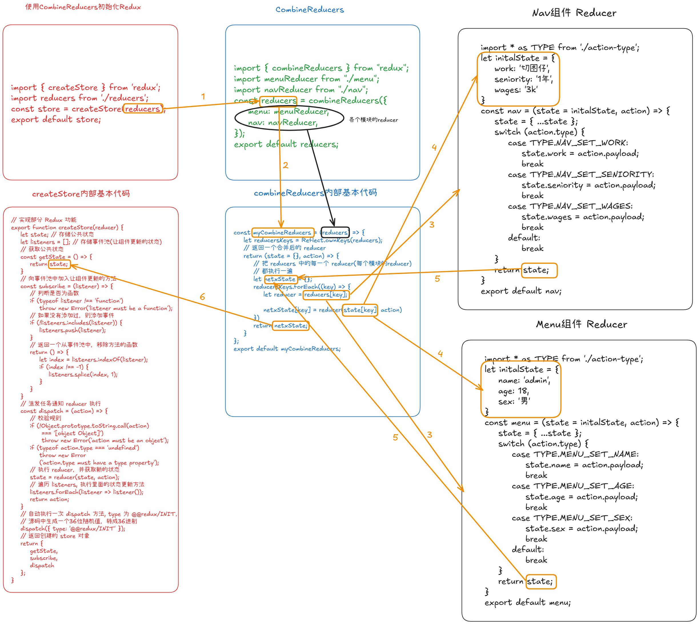

##### 四十三，React-Redux

```js
安装 react-redux npm i react-redux
使用 react-redux

第一步：
	在入口文件中，引入 store 文件以及 react-redux 中的 Provider 组件
    Provider 组件可以接收一个 store
    
    import React from 'react';
	import ReactDOM from 'react-dom/client';
	import '@/index.less';
	import App from '@/App';
	import { ConfigProvider } from 'antd';
	import zhCN from 'antd/locale/zh_CN';
	import "dayjs/locale/zh-cn";
	import '@ant-design/v5-patch-for-react-19';
	import store from "./store";	//引入store文件
	import { Provider } from "react-redux"; //引入Provider

	const root = ReactDOM.createRoot(document.getElementById('root'));
	root.render(
  		<ConfigProvider locale={zhCN} >
    		<Provider  value={store}>
    			<App />
    		</Provider>
  		</ConfigProvider>,
	);

第二部：
	在组件内部使用 react-redux 公共信息
    利用 react-redux 内部的 connect 方法，
    
    connect((state)=>{},(dispatch)=>{}):接收两个回调函数
    第一个回调函数返回可以在 state 获取所以公共信息，需要用到的公共信息在回调函数返回即可
    第二个回调函数返回修改公共信息的方法，用法如下
    
    export default connect(
    	(state) => state.menu,
        (dispatch) => ({
        	changeName: () => dispatch({ type: menu.setName(), payload: '张三' }),
        	changeAge: () => dispatch({ type: menu.setAge(), payload: 20 }),
        	changeSex: () => dispatch({ type: menu.setSex(), payload: '女' })
    	})
	)(Index);
	
	dispatch 的第二种用法
    connect() 组件
    会在组件的 props 中自动加一个 dispatch 方法，直接调即可
    
    connect((state)=>需要什么数据，就返回什么数据即可，(dispatch)=>{})(组件)
	state:公共信息
    dispatch:修改公共信息
    然后在组件的 props 中可以获取需要用到公共信息
    
    import React, { useContext, useState, useEffect } from 'react';
	import { Button } from 'antd';
	import menu from '@/store/actions/menu';
	import { connect } from 'react-redux';
	const Index = (props) => {
    	const { name, age, sex } = props; // 使用公共信息
    	const changeName = () => { };
   		const changeAge = () => { }
    	const changeSex = () => { }
    	return (
        	<div>
            	<div>姓名：{name}</div>
            	<div>年龄：{age}</div>
            	<div>性别：{sex}</div>
            	<Button onClick={changeName} >修改姓名</Button>
            	<Button onClick={changeAge} >修改年龄</Button>
            	<Button onClick={changeSex} >修改性别</Button>
        	</div>
    	);
	}
	export default connect(
    	(state) => state.menu,
	)(Index); // 调用 connect 方法并返回需要的公共数据
    
第三步：
	调用 dispatch 修改信息
    dispatch 的第二种用法
    connect()(组件)，
    会在在组件的 props 中自动加一个 dispatch 方法，直接调用即可
    
    import React, { useContext, useState, useEffect } from 'react';
	import { Button } from 'antd';
	import menu from '@/store/actions/menu';
	import { connect } from 'react-redux';
	const Index = (props) => {
    	const { name, age, sex, dispatch } = props;// 使用公共信息
    	const changeName = () => {
        	dispatch({ type: menu.setName(), payload: '张三' })
    	};
    	const changeAge = () => {
        	dispatch({ type: menu.setAge(), payload: 20 })
    	}
    	const changeSex = () => {
        	dispatch({ type: menu.setSex(), payload: '女' })
    	}
    	return (
        	<div>
            	<div>姓名：{name}</div>
            	<div>年龄：{age}</div>
            	<div>性别：{sex}</div>
            	<Button onClick={changeName} >修改姓名</Button>
            	<Button onClick={changeAge} >修改年龄</Button>
            	<Button onClick={changeSex} >修改性别</Button>
        	</div>
    	);
	}
	export default connect(
    	(state) => state.menu,
	)(Index); // 调用 connect 方法并返回需要的公共数据

```

##### 四十四，手写 React-redux 部分源码

```js
第一步：
	首先 React-redux 需要导出一个 Provider 组件
	Provider 组件 需要接收一个 store 公共信息
	并且要把这个 store 公共信息传递 Provider 组件下所有的子组件
	所以需要用全局上下文，createContext 创建全局上下文
	返回 <Context.Provider value={{store}}>{children}</Context.Proverder>;
	
第二部：
	React-redux 还需要导出一个 connect 方法
	connect 方法接收两个参数：
		mapStateToProps:不是必传，
		mapDispatchToProps:不是必传，
	connect 方法返回一个 currying 函数，
	需要判断 mapStateToProps 和 mapDispatchToProps 这两个参数都不传的情况下：
		mapStateToProps 等于一个函数，该函数接收一个参数，参数默认是对象，并返回出去
		mapDispatchToProps 等于一个函数，该函数接收一个参数，参数是 dispatch,并返回去除 {  dispatch }
		connect 方法返回 currying 函数：接收一个参数，参数是一个组件（Component）
		currying 函数返回一个高阶组件 HOC
		高阶组件 HOC 返回的是 currying 函数接收的组件（Component）
		高阶组件 HOC 需要把自身接收到的 props 传递给 Component 组件
		高阶组件 HOC 内首先要用 useContext 拿到创建号的全局上下文 store,
        并解构出 store 中的 getState 和 dispatch 以及 subcribe 这三个方法
        首先需要在 useEffect 中调用 subscribe 函数并把刷新页面的状态函数传递进去
        然后在调用 getState 方法 拿到state 公共数据并且传递给 Component 组件
        最后在判断 mapDispatchToProps 是否是一个函数，是的话，直接调用 并把dispatch 传递进去
        如果不是，那么就需要调用 Redux 中的 bindActionCreators 方法
        把 mapDispatchToProps 和 dispatch 依次传递进去，在赋值给新的变量，把这个新的变量传递给 Component 组件
        

import React, {
    createContext,
    useContext,
    useEffect,
    useState,
    useMemo
} from "react";
import { bindActionCreators } from "redux";
const Context = createContext();
// Provider
export const Provider = (props) => {
    let { store, children } = props;
    return (
        <Context.Provider value={{ store }}>
            {children}
        </Context.Provider>
    )
}
// connect
export const connect = (mapStateToProps, mapDispatchToProps) => {
    if (!mapStateToProps) {
        mapStateToProps = (obj = {}) => obj;
    }
    if (!mapDispatchToProps) {
        mapDispatchToProps = (dispatch) => {
            return {
                dispatch
            }
        };
    }
    return function currying(Component) {
        return function HOC(props) {
            const { store } = useContext(Context);
            const { getState, dispatch, subscribe } = store;
            let [, forceUpdate] = useState(0);
            useEffect(() => {
                let unSubscribe = subscribe(() => {
                    forceUpdate(+new Date())
                })
                return () => {
                    unSubscribe()
                }
            }, [])
            const state = getState();
            // 将 state 缓存起来
            const newState = useMemo(() => mapStateToProps(state), [state]);
            let newDispatch = {};
            if (typeof mapDispatchToProps === 'function') {
                newDispatch = mapDispatchToProps(dispatch);
            } else {
                newDispatch = bindActionCreators(mapDispatchToProps, dispatch);
            }
            return <Component
                {...props}
                {...newState}
                {...newDispatch}
            />
        }
    }
}
```

##### 四十五，Redux-Tookit

```js
第一步：
	创建 store 文件夹，在 store 文件夹下创建 index.js 文件
    import { configureStore } from "@reduxjs/toolkit";
	import menu from "./menu";
	const store = configureStore({
    	reducer: {
        	menu,
    	},
	})
	export default store;

	在 store 文件下创建 menu.js 文件
    import { createSlice } from "@reduxjs/toolkit";
	const menuSlice = createSlice({
    	name: "menu",
    	initialState: {
        	name: 'admin',
        	age: 18,
        	sex: '男',
        	arr: []
    	},
    	reducers: {
        	setName(state, action) {
            	state.name = action.payload
        	},
        	setAge(state, action) {
            	state.age = action.payload
        	},
        	setSex(state, action) {
            	state.sex = action.payload
        	},
        	setArr(state, action) {
            	state.arr = action.payload
        	},
    	}
        middleware:['中间件','中间件']
	});
	export const { setName, setAge, setSex, setArr } = menuSlice.actions;
	// 异步调用
	export const setNameAsync = () => {
    	return async (dispatch) => {
        	try {
            	let res = await fetch('/jian/subscriptions/recommended_collections')
            	let data = await res.json()
            	dispatch(setArr(data))
        	} catch (err) {
            	console.log(err)
        	}
    	}
	}
	export default menuSlice.reducer;

第二步：
	在入口文件中引入 store 文件，并使用 react-redux 中的 Provider
    import React from 'react';
	import ReactDOM from 'react-dom/client';
	import '@/index.less';
	import App from '@/App';
	import { ConfigProvider } from 'antd';
	import zhCN from 'antd/locale/zh_CN';
	import "dayjs/locale/zh-cn";
	import '@ant-design/v5-patch-for-react-19';
	import store from "./store";	//引入store文件
	import { Provider } from "react-redux"; //引入Provider
	const root = ReactDOM.createRoot(document.getElementById('root'));
	root.render(
  		<ConfigProvider locale={zhCN} >
    		<Provider  store={store}>
    			<App />
    		</Provider>
  		</ConfigProvider>,
	);

第三步：
	在组件内使用
    import { useEffect, useMemo } from 'react';
    import { Button } from 'antd';
	import { useDispatch, useSelector } from 'react-redux';
	import { setName, setAge, setSex } from '../store/menu';
	const Menu = () => {
    	const dispatch = useDispatch();
    	const { name, age, sex } = useSelector(state => state.menu);
    	const changeName = () => {
        	dispatch(setName('张三'))
    	};
    	const changeAge = () => {
        	dispatch(setAge(20))
    	}
    	const changeSex = () => {
        	dispatch(setSex('女'))
    	}
        useEffect(() => {
        	dispatch(setNameAsync())
    	}, [])
    	const newName = useMemo(() => {
        	return `我是${name}`
    	}, [name])
    	return (
        	<div>
            	<div>姓名：{name}</div>
            	<div>年龄：{age}</div>
            	<div>性别：{sex}</div>
				<div>{newName}</div>
            	<Button onClick={changeName} >修改姓名</Button>
            	<Button onClick={changeAge} >修改年龄</Button>
            	<Button onClick={changeSex} >修改性别</Button>
        	</div>
    	);
	}
	export default Menu
```

##### 四十六，React-router

```js
SPA:一个页面，许多个组件
	不利于 SEO 优化，公共资源只需要加载一次，跳转时主页面不刷新，组件之间的切换，数据传递方式多样化，可以本地储存以及全局变量和组件通信等等
	
MPA:许多个完整的页面
	可以直接做 SEO 优化，公共资源需要重新加载，跳转时整个 HTML 页面切换，全局刷新，数据传递只能基于本地存储以及 url 查询字符串
```

##### 四十七，React-router-dom v5版本

```jsx
react-router-dom 两种路由模式：
	哈希路由: HashRouter
	history路由:BrowserRouter
	
import { HashRouter, Route, Switch, Redirect, Link } from 'react-router-dom';
	HashRouter: 哈希路由
    Route: 匹配路由
    Switch: 只匹配一个路由
	Redirect: 重定向
    Link: 路由跳转
    
所有的路由都需要 HashRouter 或者 BrowserRouter 标签包裹起来
	<HashRouter>
    	<Route></Route>
	<HashRouter>

Route:
	path 和 component 属性必填
    path: 路径
    component: 页面文件
    <Route patch="xx" component={xx}></Route>

Switch: 确保路由只会匹配一项，匹配成功后则不会继续向下匹配
	<HashRouter>
        <Switch>
    		<Route exact></Route>  exact：开启精准匹配，只会匹配路由名称完全相同对的页面
        	<Redirect to="/" />    重定向：当匹配所有的路由不成功时则会重定向到 to 属性指定的页面
        </Switch>	
	<HashRouter>
        
Redirect:
	from: 从哪一个地址过来的
    to: 重定向的地址
    exact: 对 from 的地址精准匹配
```

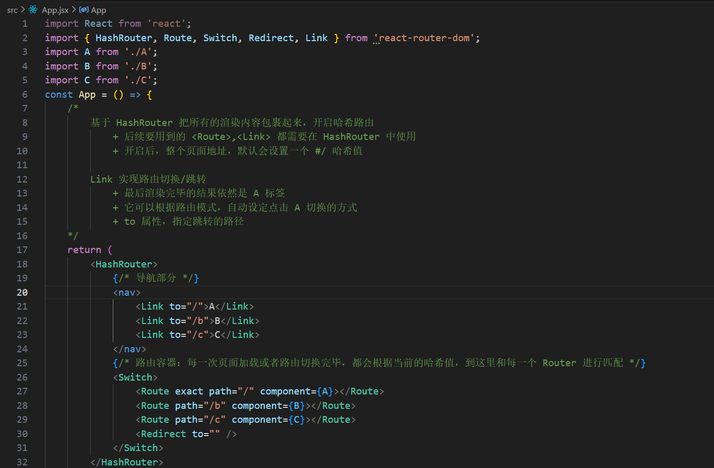

##### 四十八，React-router-dom v5 版本 多级路由

```js
Route:
	这个组件的 component 属性也可以用 render 这个属性代替
	render: 接收一个函数，地址匹配上时会执行这个函数
    <Route
		path="/"
		render={()=>{
            这里可以写一些逻辑
            return <组件 />
        }}
	></Route>
```

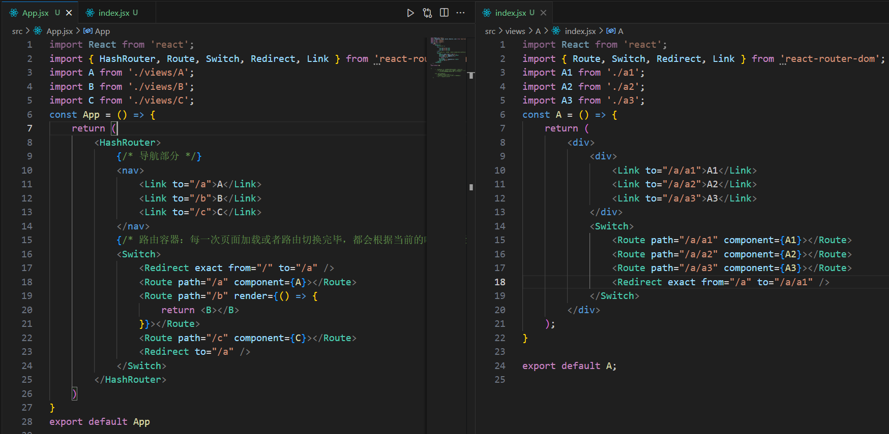

##### 四十九，构建路由表统一管理路径

```js
/*
	配置路由表：
		数组，数组中的每一项就是一个需要配置的路由规则
		+ redirect: true 重定向
		+ from: 来源的地址
		+ to: 重定向的地址
		+ exact: 是否精准匹配
		+ path: 路由的路径
		+ component: 路由对应的组件
		+ name: 路由名称
		+ meta: {} 路由元信息
		+ children: [] 子路由
*/

在 src 创建 router 文件夹
在 router 文件夹创建 index.js 和 routers.js 文件
第一步：
	routers.js 文件下配置号对应的路由信息
    import A from '../views/A'
	import B from '../views/B'
	import C from '../views/C'
	import A1 from '../views/A/a1'
	import A2 from '../views/A/a2'
	import A3 from '../views/A/a3'
	const routers = [
    	{
        	redirect: true,
        	from: '/',
        	to: '/a',
        	exact: true
    	},
    	{
        	path: '/a',
        	component: A,
        	name: 'a',
        	meta: {},
        	children: [
            	{
                	redirect: true,
                	path: 'a1',
                	component: A1,
                	name: 'a1',
                	meta: {}
            	},
            	{
                	path: 'a2',
                	component: A2,
                	name: 'a2',
                	meta: {}
            	},
            	{
                	path: 'a3',
                	component: A3,
                	name: 'a3',
                	meta: {}
            	}
        	]
    	},
    	{
        	path: '/b',
        	component: B,
        	name: 'b',
        	meta: {}
    	},
    	{
        	path: '/c',
        	component: C,
        	name: 'c',
        	meta: {}
    	},
    	{
        	redirect: true,
        	to: '/a',
    	}
	]
	export default routers
    
第二步：
	在 index.js 下循环出路由
    import React from "react";
	import { Redirect, Route, Switch } from "react-router-dom";
	const RouteView = (props) => {
    	let { routers } = props;
    	return (
        	<Switch>
            	{
                	routers.map((item, index) => {
                    	let { redirect, from, to, exact, path, component: Component } = item
                    	let config = {};
                    	if (redirect) {
                        	config = { to }
                        	if (from) {
                            	config.from = from;
                        	}
                        	if (exact) {
                            	config.exact = exact;
                        	}
                        	return <Redirect key={index} {...config} />
                    	}
                    	config = { path }
                    	if (exact) {
                        	config.exact = exact;
                    	}
                    	return (
                        	<Route
                            	key={index}
                            	{...config}
                            	render={() => {
                                	return (
                                    	<Component />
                                	)
                            	}}
                        	/>
                    	)
                	})
            	}
        	</Switch>
    	)
	}
	export default RouteView;

第三步：
	在组件中使用
    import React from 'react';
	import { HashRouter, Route, Switch, Redirect, Link } from 'react-router-dom';
	import RouterView from './router';
	import routers from './router/routers';
	const App = () => {
    	return (
        	<HashRouter>
            	{/* 导航部分 */}
            	<nav>
                	<Link to="/a">A</Link>
                	<Link to="/b">B</Link>
                	<Link to="/c">C</Link>
            	</nav>
            	{/* 路由容器：每一次页面加载或者路由切换完毕，都会根据当前的哈希值，到这里和每一个 Router 进行匹配 */}
            	<div>
                	<RouterView routers={routers}></RouterView>
           	 	</div>
        	</HashRouter>
    	)
	}
	export default App

```

##### 五十，路由懒加载

```js
/*
	路由在不使用懒加载的情况下，第一次加载页面的时候，从服务器获取整个 JS 文件就会用很久的事件，
	导致此阶段，页面一致处于白屏状态
*/
优化方案：
	分割打包: 每个组件会单独打包为一个JS， 
    按需导入/加载: 最开始不会加载，只有路由匹配成功才会去加载
    按需异步加载 JS ===> 路由懒加载
	在 React 提供了一个 lazy 懒加载方法
    lazy方法：
    lazy(()=> import('../组件'))
	lazy(()=> import(/* webpackChunkName:"Achild" */ "../A/A1"))
					/* webpackChunkName:"Achild" */: 可以配置该文件打包在 Achild.js 文件中
                    
    同时还需要 Suspense 组件包裹以及渲染了的组件
    	Suspense 组件：
        	有一个 fallback 属性：组件还未加载出来的时候会渲染 fallback 属性的内容
            <Suspense fallback={<>正在加载中...</>}>
                <Component></Component>
            </Suspense>
```

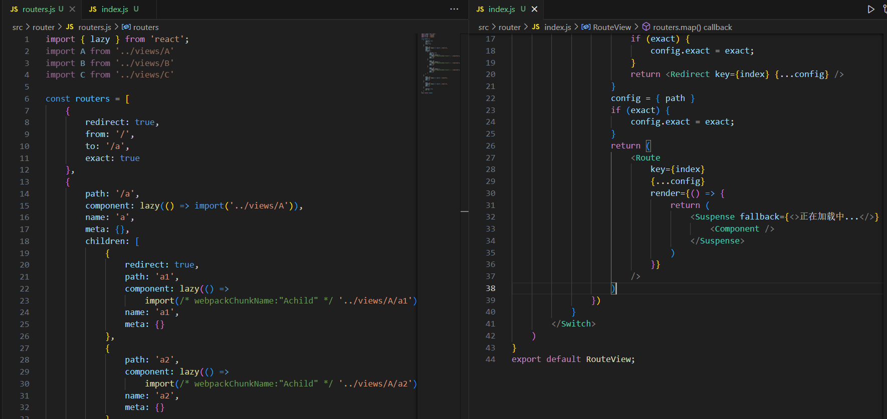

##### 五十一，获取到路由中的相关信息以及路由跳转

```js
方法一：
	在 react-router-dom 中有四个 hooks 方法
		useHistory,
		useLocation,
		useRouteMatch,
		useParams,
	以上这几个方法可以拿到路由相关信息

方法二：
	在封装的 RouterView 的 Router 中使用的 render 方法中可以接收到一个 props 中也可以拿到，拿到后传递给组件即可
	
路由跳转：
	编程式
    在 history 对象下存在以下几个方法
    1. go
    2. goBack
    3. goForward
    4. push
    5. replace
    前三个方法是前进后退
    第四个方法是直接跳转到某一个页面，会新增历史记录
    四五个方法是直接跳转到某一个页面，是替换当前历史记录
    
    导航式
    使用 Link 路由跳转
    <Link to="路由地址" ><Link>
    <Link to={{
    	pathname:'路由名称'
        search:"url传参"
        state:{ 隐式传参 }
             }}>
    </Link>
	<Link to="路由地址" replace ><Link> 不再是新增一条历史记录，而是替换对应历史记录

路由传参：
	接收：
    在 location 中对象下存在的属性都是有上一个路由跳转过来的携带的参数
    该对象下存在 pathname,state,search,hash
	
	传递：
    props.history.push({
        pathname:"/c",
        state:{ name:'c' },
        search:"?name=c",
    })

注意项：
	只有在 react-router-dom 中的 <HashRouter></HashRouter> 包裹的组件，才能拿到对应的路由信息
```

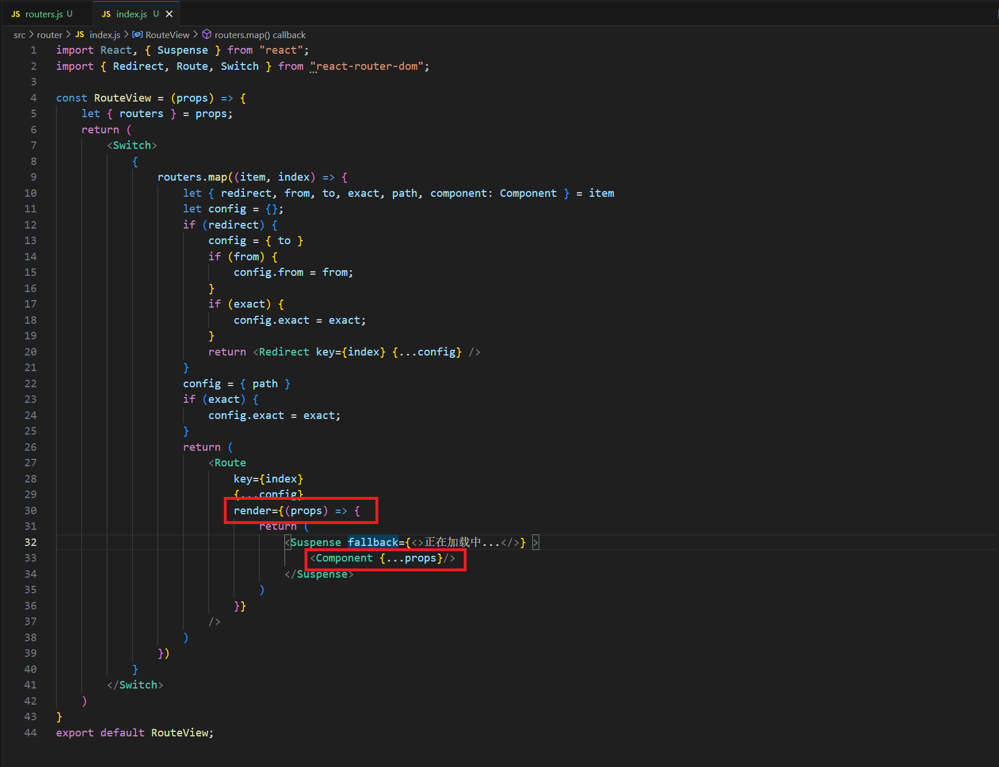

##### 五十二，NavLink 和 Link 的区别

```
语法以及用法一样
区别：
	Navlink:
		每次页面加载或者路由切换完毕，都会那最新的路由地址，和 NavLink 中 to 指定的地址进行匹配，匹配上一样的，会默认设置 active 选中的样式，也可以基于 activeClassName 重定向样式类名
```

##### 五十三，react-router-dom @6 版本

```js
移除了： Switch, Redirect, withRouter

Switch ===> Routers:被 Routers 替代

Router:
	语法也发生变化，不在需要 exact 做精准匹配，自带精准匹配
    <Router path="地址" element={<组件></组件>}></Router>
                               
Redirect ===> Navigate:
	被 Navigate 替代，而且不能直接放在 Routers 下作为它的子组件，
    只能放在 Route 的 element 属性作为它的属性值
    path="/a/:id?"
    	id: params 参数
       	?: 可传可不传                       
                               	
    <Route path="/" element={<Navigate to="/a" ></Navigate>}></Route>
    <Route path="/a/:id?" element={<Navigate to={{
    	pathname:'/a',
        search:'?from=404'         
    }} ></Navigate>}></Route>
                               
useNavigate:
	替代了 push和replace
    import { useNavigate } from "react-router-dom"
	const navigate = useNavigate()
    navigate("地址")
	navigate("地址",{replace:true}) // 不新增历史记录
	naviagete({
        pathName:"地址"，
        search:"url传参"
    })
	navigate("地址"，{
    	replace:true,
        state:{"隐式传参"} // 刷新页面 state 的数据不会丢失
    })
```

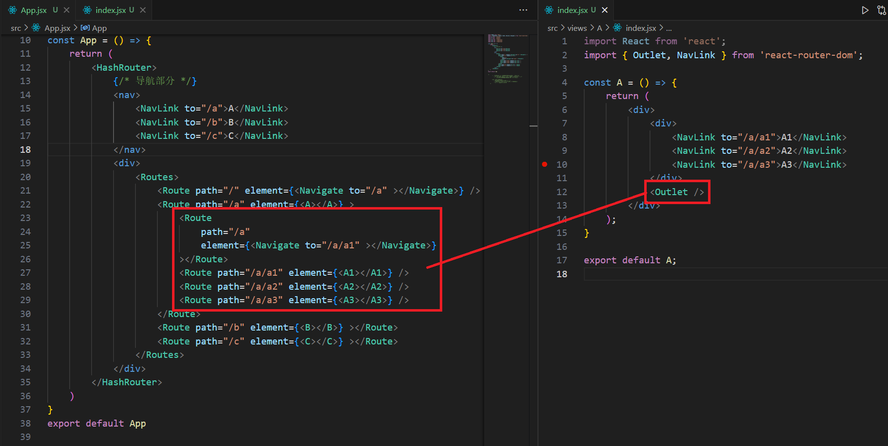

##### 五十四，对 react-router-dom @6 路由表统一管理

```js
在 srcc 下创建 router 文件夹
在 router 文件夹创建 index.js 和 router.js 文件

第一步：
	在 router.js 文件配好路由表信息
	import { lazy } from 'react';
	import { Navigate } from 'react-router-dom';
	const routes = [
    	{
        	path: '/',
        	element: () => <Navigate to="/a" ></Navigate>
    	},
    	{
        	path: '/a',
        	name: 'a',
        	element: lazy(() => import('../views/A')),
        	meta: {},
        	children: [
            	{
                	path: '/a',
                	element: () => <Navigate to="/a/a1" ></Navigate>
            	},
            	{
                	path: 'a1',
                	name: 'a1',
                	element: lazy(() => import('../views/A/a1')),
                	meta: {}
            	},
            	{
                	path: 'a2',
                	name: 'a2',
                	element: lazy(() => import('../views/A/a2')),
                	meta: {}
            	},
            	{
                	path: 'a3',
                	name: 'a3',
                	element: lazy(() => import('../views/A/a3')),
                	meta: {}
            	},
        	]
    	},
    	{
        	path: '/b',
        	name: 'b',
        	element: lazy(() => import('../views/B')),
    	},
    	{
        	path: '/c/:id?',
        	name: 'c',
        	element: lazy(() => import('../views/C')),
    	},
	]
	export default routes
	
	在 index.js 下循环出路由
	import React, { Suspense } from "react";
	import { Route, Routes, useNavigate, useLocation, useParams, useSearchParams } from "react-router-dom";
	import routes from "./routes";
	const Elements = (props) => {
    	let { element: Element } = props;
    	const navigate = useNavigate();
    	const location = useLocation();
    	const params = useParams();
    	const [searchParams] = useSearchParams();
    	const routingInfo = {
        	navigate,
        	location,
        	params,
        	searchParams
    	}
    	return <Element {...routingInfo} />
	}
	const createRouter = (routes) => {
    	return (
        	<>
            	{routes.map((item, index) => {
                	let { path } = item;
                	return (
                    	<Route
                        	key={index}
                        	path={path}
                        	element={<Elements {...item} />}
                    	>
                        	{item.children &&
                            	item.children.length > 0 &&
                            	createRouter(item.children)
                        	}
                    	</Route>
                	)
            	})}
        	</>
    	)
	}
	const RouterView = () => {
    	return (
        	<Suspense fallback={<>正在加载中...</>} >
            	<Routes>{createRouter(routes)}</Routes>
        	</Suspense>
    	)	
	}
	export default RouterView;
	
	export const widthRouter = (Component) => {
    	return (props) => {
        	const navigate = useNavigate()
        	const location = useLocation()
        	const params = useParams()
        	const [searchParams] = useSearchParams()
        	const routingInfo = {
            	navigate,
            	location,
            	params,
            	searchParams
        	}
        	return <Component {...props} {...routingInfo} />
    	}	
	}
	
	在组件中使用
	import React from 'react';
	import { HashRouter, NavLink } from 'react-router-dom';
	import RouterView from './router'
	const App = () => {
    	return (
        	<HashRouter>
            	{/* 导航部分 */}
            	<nav>
                	<NavLink to="/a">A</NavLink>
                	<NavLink to="/b">B</NavLink>
                	<NavLink to={{
                    	pathname: '/c/1',
                    	search: '?from=404',
                	}}>C</NavLink>
            	</nav>
            	<div>
                	<RouterView></RouterView>            
            	</div>
        	</HashRouter>
    	)
	}
```

##### 五十五，配置样式全局变量

```
安装 style-resources-loader
命令 npm i style-resources-loader

在 config 文件夹下的 webpack.config.js文件

在 src 目录下 创建 common.less 文件

需要配置 scss 或者 sass 就创建 common.scss/common.sass
```

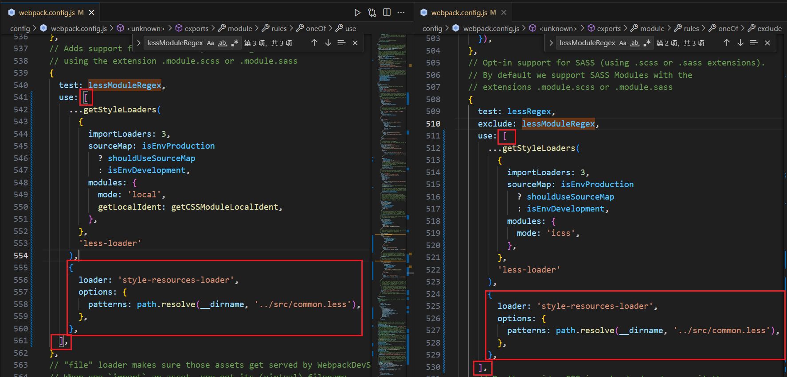

##### 五十六，useReducer

```js
类似 redux
用法：接收两个参数
	参数1: reducer 方法
	参数2: 初始值对象
	const A1 = () => {
    	const reducer = (state, action) => {
        	state = { ...state };
        	switch (action.type) {
            	case 'add':
                	return { count: state.count + 1 }
            	case 'minus':
                	return { count: state.count - 1 }
            	default:
                	throw new Error();
        	}
    	}
    	const [state, dispatch] = useReducer(reducer, { count: 0 });
    	return (
        	<div>
            	A1组件
            	<div>{state.count}</div>
            	<Button onClick={() => dispatch({ type: 'add' })} >加</Button>
            	<Button onClick={() => dispatch({ type: 'minus' })} >减</Button>
        	</div>
    	);
	}
	export default A1;
	
```

##### 五十七，Rem响应式布局处理

```js
Rem 响应式布局开发
	1. 按参照的比例（设计稿通常是 750px）,在这个比例下，给根节点的 fontSize 设置一个初始值
		750px 设计稿中，1Rem = 100px
		
	2. 我们需要根据当前设备的宽度，计算相当于设计稿的缩放比例
	 
    在 HTML 文件中
	// 计算当前设备下，rem和 px 的换算比例
		(function (){
			const computed = () => {
				// 获取设备宽度
                let html = document.documentElement,
                    deviceW = html.clientWidth,
                    designW = 750;
                let ratio=deciceW*100/750
                html.style.fontSize = ratio + 'px'
			}
            computed();
        	window.addEventListener('resize',computed);
		})()

插件：
	lib-flexible : 设置 rem 和 px 换算比例
	postcss-pxtorem : 自动将 px 换算成  rem
安装命令：
	npm i lib-flexible --save
	npm i postcss-pxtorem --save
    
    在 config 文件夹下的 webpack.config.js文件配置
	在 index.jsx 中导入 lib-flexible
	设置最大宽度 在 index.jsx 文件下
    	// 处理最大宽度
		(function (){
  			const handleMax = function (){
    			let html = document.documentElement,
        		root = document.querySelector('#root'),
        		size = parseFloat(html.style.fontSize)
        		html.style.maxWidth = '750px'
        		if(size >= 75){
          			root.style.fontSize = '75px'
        		}
  			}
  			handleMax()
		})()
```

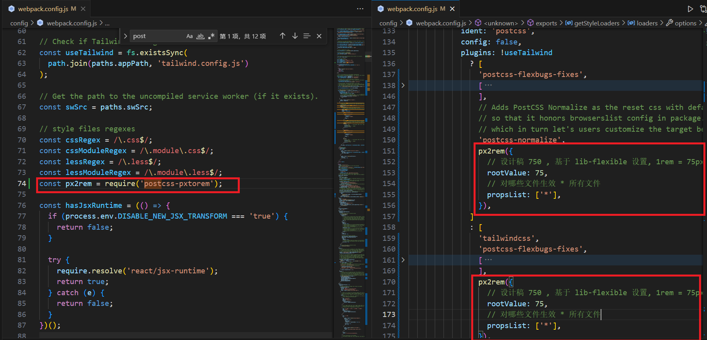

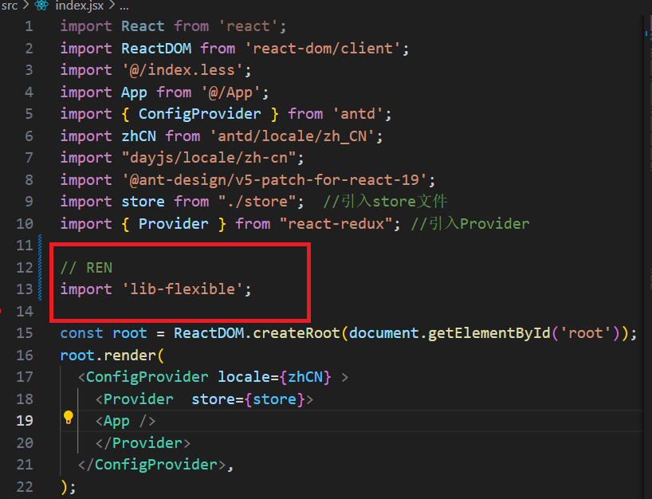

##### 五十八，React组件缓存

```js
安装 keepalive-react-component
命令 npm i keepalive-react-component

import { KeepAliveProvider, widthKeepAlive  } from "keepalive-react-component";

KeepAliveProvider:
	<KeepAliveProvider>
        需要缓存的路由配置表
    </KeepAliveProvider>

widthKeepAlive:
	widthKeepAlive(组件，{ cacheId: '定义一个id', scroll: true })
    scroll: 缓存页面滚动的位置
    
注意：
	widthKeepAlive 包裹的组件，如果有子路由，会使其不渲染，这是keepalive-react-component 与 react-router-dom 的兼容性问题导致的，推荐使用 react-activation
```

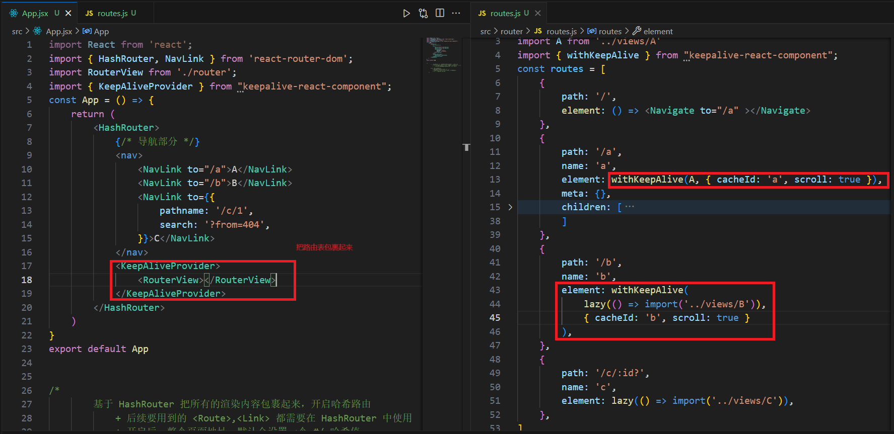

##### 五十九，React中的 DOM-DIFF 算法和 Fiber 算法

```js
在 React16 及以前：新老虚拟 DOM 对比
在 React17 及以后：老的 DOM 会构建出 Fiber 链表，拿到最新创建的虚拟 DOM 和 Fiber 链表做对比

优化原则
	1. 深度优先原则：会先比较元素的后代元素，一级一级的比下去
	2. 同级对比：只会比较处于同一级别的元素
	3. 不同类型的元素，会产生不同的结构：销毁老结构，创建新结构
	4. 可以通过 key 标识移动的元素：如果不设置 key，则默认元素的“索引”就是 key
	
处理规则：
	key 和 “类型”都相同：更新复用老节点
	key和“类型”只要有一个不同：删除老的，插入新的

具体处理步骤
	第一轮循环：遍历 Fiber 链表，去虚拟 DOM 中找到相同位置的新节点，进行对比（不是按照 key 比，按照位置比），对比的时候，先看 key
		key 一样：再看标签和内容
			标签一样，内容也一样，则复用旧节点（啥都不处理）
			标签一样，内容不一样，则把旧节点标记为“更新”
			标签不一样，则旧节点标记为“删除”，新节点标记为“新增”
		key不一样：直接跳出第一轮循环
		
	第二轮循环：根据 Fiber 链表，创建 Map 查找映射表，遍历虚拟 DOM，查找 Map 映射表
		Map = { A:就节点，B：旧节点，... }  以 key 作为属性名，节点作为属性值
		从虚拟 DOM 的第一个节点开始遍历（第一轮循环处理过的可以不用管了），没处理过的则去 Map 映射表中，找到“相同key”的旧节点进行对比，按照 key 进行比较
		找到相同 key 的旧节点：
			先对比标签和内容
			然后拿旧节点的权重值（旧索引值）再和全局的最高权重值（lastPlacedIndex）进行比较，来决定位置是否挪动			
		找不到相同 key 的旧节点：
			说明此节点需要新增，标记为“新增”
    
	第二轮结束后，把没有比较过的旧节点，标记为“删除”
    
如果组件更新后，节点的 key 值和节点所在的“顺序”没有变化过，只需要经过第一轮循环，就可以分析出：节点的更新规则，这种情况，DOM-DIFF 计算的性能也会提高
			
```

##### 六十，Iterator 迭代器和 for-of 原理

```js
手写 Iterator 迭代器
	// 创建一个 Iterator 类
	class Iterator {
    	constructor(assenble) {
        	// assenble 需要迭代的数据结构
        	this.assenble = assenble;
        	// index 记录迭代的次数
        	this.index = -1;
    	}
    	next() {
        	this.index++;
        	let { assenble, index } = this;
        	if (this.index >= assenble.length) {
            	// 迭代完成
            	// 需要将 index 重置为 -1
            	this.index = -1;
            	return {
                	done: true,
                	value: undefined
            	}
        	}
        	return {
            	done: false,
            	value: assenble[index]
        	}
    	}
	}
/*
    创建一个实例对象，其应该具备迭代器规范要求
        itor.next() 具备 next 方法，执行这个方法可以依次获取到数据结构中的每一个成员值
        每一次获取的成员值是一个对象
            done: // 是否迭代完成
            value: // 迭代到的成员值
*/

for-of 不可以遍历对象，可以在对象原型上新增 Symbol.iterator 迭代器

	Object.prototype[Symbol.iterator] = function iterator() {
    	let self = this;
    	let index = -1;
    	let keys = Reflect.ownKeys(self)
    	return {
        	next() {
            	index++;
            	if (index >= keys.length) {
                	index = -1;
                	return {
                    	done: true,
                    	value: undefined
                	}
            	}
           		let key = keys[index]
            	return {
                	done: false,
                	value: self[key]
            	}
        	}
    	}
	}
```

##### 六十一，Generator 和 await 原理

```js
async/await 原理：基于 Promise 和 Generator 函数实现
    
/*
    创建一个 Generator 生成器函数，
    在创建的函数“function”后面加一个“*”即可
    ES6 语法：*函数
    箭头函数无法变成生成器函数
    每一个生成器函数，都是 GeneratorFunction 的实例，
    然后再是 Function 的实例

    生成器函数执行：
        不会立即把函数执行
        而是返回一个迭代器对象
        当执行这个迭代器里面的 next 方法时，才会执行函数
        返回 {done: true/false, value: any} 的对象

    生成器函数作用：
        基于返回的额迭代器对象里的 next 方法
        控制函数中的代码一步步执行
        每次执行 next 方法时，控制函数内代码执行，
        直到遇到 yield 则结束，
        返回一个 {done: false, value: yield 后面的值} 的对象
        遇到 return 或者函数执行到最后时，
        返回一个 {done: true, value: return 后面的值} 的对象
        迭代器内部的 throw 方法可以抛出异常，终止代码执行
        迭代器内部的 return 方法 相当于在函数执行时遇到 return
        yield* 可以让我们进入另一个生成器函数中执行
    
    迭代器.next(N)：每次执行 next 方法时，
    传递的值会作为上一个 yield 的返回值，
*/
const delay = (time) => {
    return new Promise((resolve) => {
        setTimeout(() => {
            resolve(`延时 ${time} 毫秒`);
        }, time);
    });
}
const handle = function* () {
    let value = yield delay(1000); 
    console.log(value); // 输出：延时 1000 毫秒
    value = yield delay(2000);
    console.log(value); // 输出：延时 2000 毫秒
    value = yield delay(3000);
    console.log(value); // 输出：延时 3000 毫秒
    value = yield delay(4000);
    console.log(value); // 输出：延时 4000 毫秒
}
// 参数 generator： 生成器函数
const AsyncFunction = function AsyncFunction(generator, ...params) {
    let itor = generator(...params);
    // 基于递归，将 gengerator 中的代码逐一执行
    const next = x => {
        let { done, value } = itor.next(x);
        // 如果 done 为 true，说明函数执行完毕
        if (done) return value;
        // 如果值不是 Promise，则将其转换为 Promise
        if (!(value instanceof Promise)) value = Promise.resolve(value);
        // 递归执行 next 方法
        value.then(next);
    }
    next();
}
AsyncFunction(handle);

```

##### 六十二，UmiJs

```js
创建命令：
	pnpm dlx create-umi@latest

设置环境变量：
	在根目录下的 .env 文件
    HOST = 127.0.0.1 // 地址
	PORT = 3000 // 端口号
```

##### 六十三，Umi4 配置

```ts
在根目录下创建 config 文件夹，在里面创建 config.ts 文件
import { defineConfig } from '@umijs/max';
import routes from '../src/routes/routes';
export default defineConfig({
    antd: {
        theme: {
            '@primary-color': '#6E48C2', //修改主题⾊
        },
    },
    layout: {
        name: 'Demo', //1. 配置项⽬名称
        logo: 'https://preview.pro.ant.design/static/logo.f0355d39.svg',
        title: 'Demo',
    },
    access: {},
    model: {},
    initialState: {},
    request: {},
    routes, // 路由
    npmClient: 'pnpm',
    hash: true, // 是否开启 hash 路由
    history: { type: 'browser', }, // 设置路由 history 类型
    devtool: false, // 关闭所有环境下的 sourcemap
    externals: {}, // 设置不打包模块
    headScripts: [], // 配置 <head> 中的额外 script，减少打包后主 JS 的大小
    scripts: [], // 配置 <body> 中额外的 script 标签
    // 修改 webpack 配置
    chainWebpack(memo, { env, webpack }) {
        // memeo:现有的 webpack 配置
        // env: 当前环境变量
        // webpack: webpack 对象
        return memo;
    },
    plugins: [], // 配置额外的插件
    extraBabelPlugins: [], // 配置额外的 babel 插件
    extraBabelIncludes: [], // 配置额外的 babel 编译的 NPM 包或目录
    extraBabelPresets: [], // 配置额外的 babel 插件集
    extraPostCSSPlugins: [], // 配置额外的 postcss 插件
    publicPath: "/", // 设置打包后资源导入的路径，默认值 /，
    proxy: {}, // 代理
    alias: { '@': './src', }, // 配置别名
    analyze: true,// 开启构建分析
    locale: {
        default: 'zh-CN', // 默认语言
        antd: true, // 是否启用 Ant Design 的国际化
        title: false, // 在项目中配置的 title 及路由中的 title 可直接使用国际化 key，自动被转成对应语言的文案
        baseNavigator: false, // 开启浏览器语言检测。
    },
    // 配置图片文件是否走 base64 编译的阈值。
    // 默认是 10000 字节，少于他会被编译为 base64 编码，
    // 否则会生成单独的文件
    inlineLimit: 10000,
    // 配置构建时压缩 JavaScript 的工具，默认值 esbuild
    jsMinifier: 'esbuild',
    jsMinifierOptions: {}, // jsMinifier 的配置项
    metas: [], // 配置额外的 meta 标签
    polyfill: {}, // 设置按需引入的 polyfill。默认全量引入。
    targets: {}, // 配置需要兼容的浏览器最低版本

});

```

##### 六十三，Umi 运行时配置

```ts
在 app.ts 文件中
// 运行时配置
import { RunTimeLayoutConfig } from "./.umi/exports";
export type InitialStateProps = {
  name: string;
  collapsed?: boolean;
};
// 全局初始状态和配置
export async function getInitialState(): Promise<InitialStateProps> {
  return { name: '@umijs/max' };
}
// 布局及菜单配置
// 可参考：https://procomponents.ant.design/components/layout#prolayout
export const layout: RunTimeLayoutConfig = ({ initialState, setInitialState }) => {
  // initialState： 全局初始化数据
  // setInitialState： 更新 initialState
  // 自定义侧边栏展开状态
  const onCollapse = (collapsed: boolean): void => {
    setInitialState({ ...initialState, collapsed }).then();
  };

  let config: Record<string, any> = {
    ...initialState,
    title: 'Demo',
    logo: 'https://img.alicdn.com/tfs/TB1YHEpwUT1gK0jSZFhXXaAtVXa-28-27.svg',
    navTheme: 'light',  // 导航栏主题，'light' 或 'dark'
    primaryColor: '#1890ff',  // 主色调
    headerHeight: 48,   // 头部高度
    fixedHeader: true,  // 是否固定头部
    fixSiderbar: true,  // 是否固定侧边栏
    contentWidth: 'Fluid',  // 内容宽度，'Fluid' 为流式，'Fixed' 为固定宽度
    splitMenus: false,  // 是否启用菜单分割（多个菜单栏）
    // menu 菜单配置
    menu: {
      locale: false,  // 是否启用菜单的国际化
      disableLocal: false,  // 是否禁用本地菜单
    },
    headerRender: false,  // 是否显示头部
    headerContentRender: () => { },  // 自定义头部内容
    siderWidth: 250,  // 侧边栏宽度
    collapsedButtonRender: false, // 去掉系统自带 collapsed 按钮
    // 配置 collapsed, 值为 false 时，侧边栏不会自动折叠
    collapsed: initialState?.collapsed,
    rightContentRender: () => { }, //  自定义右侧内容
    footerRender: () => { },  // 自定义底部内容
    footerProps: { style: { textAlign: 'center' } },  // 自定义底部样式
    // 页面切换时触发
    onPageChange: (location) => {
      // location： 当前路由信息
    },
    // 自定义渲染内容
    childrenRender: (children) => {
      // children： 子路由
    },
  };
  // layout 的头像设置，不同的
  if (initialState?.头像) {
     config['avatarProps'] = {
       	src: initialState?.头像,
		size: 大小,
       	title: initialState?.用户名称,
       	render: (props, dom) => {
         	return < {组件 ...props} >{dom}</组件>;
       },
     };
   } else {
    config['avatarProps'] = {
       src: 默认头像,
       size: 大小,
       title: initialState?.默认用户名,
       render: (props, dom) => {
         return <组件 {...props} >{dom}</组件>;
       },
     };
  }
  return config;
};
// 初始加载和每次路由切换时加载
export const onRouteChange = ({ clientRoutes, location, routes }) => {
  // clientRoutes： 当前匹配的路由配置项
  // location： 当前路由信息
  // routes： 路由表，扁平化后的
}
// 动态路由，修改渲染前的路由表
export const patchClientRoutes = ({ routes }) => {
  // routes： 路由列表
}
// 自定义渲染
export const render = (oldRender) => {
  // oldRender： 原始渲染函数
  oldRender()
}
```

##### 六十四，Ant Design Pro 创建 Umi4 

```ts
命令：
	npm i @ant-design/pro-cli -g // 如果全局安装了，则不需要此命令
	pro create 项目名称
    npm i
    官网：https://pro.ant.design/zh-CN/docs/getting-started
```

##### 六十五，webpack 打包原理

```js
webpack 其实就是一个平台，在平台中，我们会安装/融入配置各种打包规则
	mode: 打包模式（开发环境 development，生产环境 production）
    entry: 入口（webpack 就是从入口开始，根据 CommonJs/Es6module 模块规范化，分析出模块之间的依赖，从而按照相关的依赖关系，进行打包）
    output: 出口
    loader: 加载器（一般都是用于实现代码编写的）
    plugin: 插件
    resolve: 解析器
    optimization: 优化项
```

##### 六十六，强缓存以及协商缓存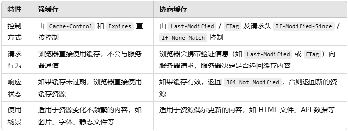

##### 六十七，useTransition 18版本和19版本区别

```tsx
作用：将一段逻辑处理标记为低优先级，等待其他逻辑都处理完后，在进行处理，主要影响的是密集型的渲染工作，延迟的不是状态更新本身，而是由状态更新触发的重渲染过程
18版本
	useTransition:
		直接调用返回一个数组
        数组的第一个元素是渲染的状态，true/false
		数组的第二个元素是一个方法
        方法接收一个回调函数，所有在回调执行的逻辑优先级都比较低，回调函数不能是异步函数
        
    基础用法：
    	import React, { useState, useTransition } from 'react';
		const C = (props) => {
    		const [isPending, startTransition] = useTransition();
    		const [arr, setArr] = useState([
        		{
            		name: 'tab1',
            		active: true,
        		},
        		{
            		name: 'tab2',
            		active: false
        		},
        		{
            		name: 'tab3',
            		active: false
        		},
    		])
    		const [index, setIndex] = useState(0);
    		const change = (index) => {
        		startTransition(() => {
            		setIndex(index)
        		})
        		setArr((pre) => {
            		return pre.map((item, i) => {
                		if (i === index) {
                    		item.active = true
                		} else {
                    		item.active = false
                		}
                		return item
            		})
        		})
    		}
    		return (
        		<div>
            		<div>
                		{
                    		arr.map((item, index) => {
                        		return (
                            		<div
                                		key={index}
                                		style={{
                                    		background: item.active ? "#ccc" : "#fff"
                                		}}
                                		onClick={() => change(index)}
                           	 		>
                                		{item.name}
                            		</div>
                        		)
                    		})
                		}
            		</div>
            		{index === 0 && <div>我是0</div>}
            		{index === 1 && <div>
                		{
                    		new Array(50000).fill(0).map((item, index) => {
                        		return <div key={index}>我是{index}</div>
                    		})
                		}
            		</div>}
            		{index === 2 && <div>我是2</div>}
        		</div>
    		);
		}
		export default C;

    19版本
    	useTransition:
			直接调用返回一个数组
        	数组的第一个元素是渲染的状态，true/false
			数组的第二个元素是一个方法
        	方法接收一个回调函数，所有在回调执行的逻辑优先级都比较低，回调函数可以是异步函数
            
            import React, { useState, useTransition } from 'react';
			const C = (props) => {
    		const [name, setName] = useState('');
    		const [isLoading, setTransition] = useTransition();
    		const sub = async () => {
        		setTransition(async () => {
            		try {
                		const res = await fetch("/zhi/news/latest")
                		const data = await res.json()
            		} catch (error) {
                	console.log(error)
            		}
        		})
    		}
    		return (
        		<div>
            		<input type="text" value={name} onChange={(e) => setName(e.target.value)} />
            		<button onClick={sub} disabled={isLoading}>{isLoading ? '加载中' : '提交'}</button>
            		<h1>{name}</h1>
        		</div>
    		);
		}
		export default C;

 19版本相比18版本，useTransition 接收的回调函数可以是异步函数
```

##### 六十八，useActionState 19版本

```tsx
useActionState
	接收三个参数：
    	参数一：回调函数，可以接收多个参数，参数一是上一次的返回值，参数二以及后面的参数，被调用传进来的参数
        参数二：初始值
        参数三(可选)：一个字符串，包含此表单修改的唯一页面 URL
    调用返回一个数组
    	元素一：参数一回调函数的返回值
        元素二：方法，调用时，传入的参数是参数一回调函数的参数二以及后面的参数
        元素三：元素渲染的状态 true/false
        
        调用方法必须放在 startTransition 方法内
        
```

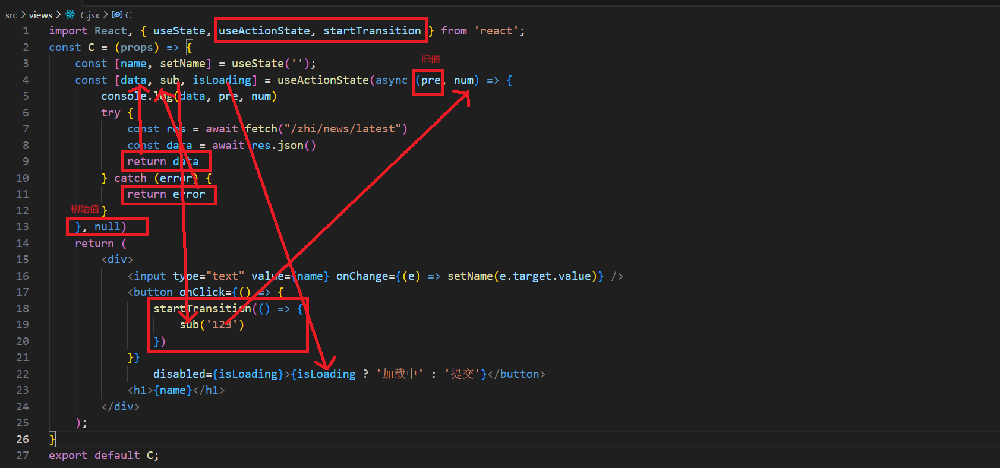

##### 六十九，useActionState 结合 From 表单使用

```tsx
import React, { useState, useActionState } from 'react';
const C = (props) => {
    const [data, sub, isLoading] = useActionState(async (pre, formData) => {
        console.log(formData.get('name'))
        console.log(formData.get('age'))
        console.log(formData.get('sex'))
        try {
            const res = await fetch("/zhi/news/latest")
            const data = await res.json()
            return data
        } catch (error) {
            return error
        }
    }, null)
    return (
        <div>
            <form action={sub}>
                <input type="text" name="name" />
                <input type="text" name="age" />
                <input type="text" name="sex" />
                <button type='submit' disabled={isLoading} >{isLoading ? '加载中' : '提交'}</button>
            </form>
            <div>{JSON.stringify(data)}</div>
        </div>
    );
}
export default C;

useActionState:
	返回的方法作为 from 的 action, button 的 type 属性改为 submit,
    点击按钮时会自动执行 useActionState 第一个参数的回调函数内逻辑，
    input 这种 name 属性
    在回调函数的第二参数，xxx.get('xxx') 可以拿到 input 对应的值
  
作用：
	from 的 action 直接接收一个 actions 函数，
    不要定义表单数据，不需要定义表单事件，
    表单可以自动重置，清空
    
```

##### 七十，useOptimistic 乐观更新

```tsx
作用：在异步操作期间(如网络请求)，先按照预估的正确结果显示了，实际异步操作还在后台执行中，如果失败了，预估值会自动回滚成真实值
	
useOptimistic(初始值，回调函数)
	参数一: 初始值
	参数二: 回调函数(旧值，传过来的新值)，返回旧值和新值合并的值
	返回值: 数组
		[返回的新值，添加新值的方法] 
		添加新值的方法需要方法startTransition 执行
		
	import React, { useOptimistic, useState, startTransition } from 'react';
	const C = (props) => {
    	const [data, setData] = useState([{
        	title: '张三',
        	id: 18,
    	}])
    	const [newData, addData] = useOptimistic(data, (oldV, newV) => {
        	return [...oldV, newV]
    	})
    	const add = (newV) => {
        	startTransition(async () => {
            	// 更新预估数据
            	addData(newV);
            	newV = await new Promise((resolve,reject)=>{
                	setTimeout(()=>{
                    	resolve({
                        	title: '刘五',
                        	id: 22
                    	})
                	},2000)
            	})
            	// 更新真实数据
            	setData((oldV) => {
                	return [...oldV, newV]
            	})
        	})
    	}
    	return (
        	<div>
            	{
                	newData.map((item, index) => {
                    	return (
                        	<div key={index} >
                            	<span>{item.title}</span>
                            	<span>{item.id}</span>
                        	</div>
                    	)
                	})
            	}
            	<button onClick={() => {
                	add({
                    	title: '李四',
                    	id: 20
                	})
            	}} >添加</button>
        	</div>
    	);
	}
	export default C;
```

##### 七十一，useFormStatus 19版本(react-dom 提供)

```tsx
作用：
	子组件可以拿到离它最近父级 form 组件的数据
    
const { pending, data, method, action } = useFormStatus();
	
	pending: 布尔值
		如果为 true, 则表示父级 <form> 正在等待提交，否则为 false
		
	data: 实现了 FormData interface 的对象，包含父级 <form> 正在提交的数据，
			如果没有进行提交或没有父级 <form>，它将为 null
			
	method: 字符串，可以是 'get' 或 'post'
			表示父级 <form> 使用 GET 或 POST HTTP 方法进行提交
			默认情况下，<form> 将使用 GET 方法，并可以通过 method 属性指定
	
	action: 一个传递给父级 <form> 的 action 属性的函数引用
			如果没有父级 <form>, 则该属性为 null
			如果 action 属性上提供了 URI 值，或者未指定 action 属性，status.action 将为 null

import React from 'react';
import { useFormStatus } from 'react-dom'

const Button = (props) => {
    let { type } = props;
    const { pending, data, method, action } = useFormStatus();
    console.log(pending, data?.get('name'), method, action)
    return <button type={type} disabled={pending}>{pending ? 'loading....' : 'submit'}</button>
}
const C = (props) => {
    return (
        <div>
            <form
                action={() => {
                    new Promise((resolve, reject) => {
                        setTimeout(() => {
                            resolve('success')
                        }, 2000)
                    })
                }}
            >
                <input type="text" name="name" />
                <Button type="submit" />
            </form>
        </div>
    );
}
export default C;

注释：
	只要 Button 组件在 form 标签中
    可以通过 useFormStatus 拿到 form 表单的提交状态（pending）
    以及 form 表单的 input数据，提交表单的接口协议（get/put/post....）
    还有 form 表单的 action (提交接口)
```

##### 七十二，use

```tsx
use 是一个 React API, 它可以让你读取类似于 Promise 或 context 的资源的值
而且还可以在条件语句以及循环中使用

读取 promise 结果
	当使用 Promise 调用 use API 时，它会与 Suspense 和 错误边界 集成
	请求接口必须放在函数组件外执行，否则会导致死循环
	
import React, { use } from 'react';

const dataPromise = new Promise((resolve, reject) => {
    resolve('张三')
})
const C = (props) => {
    const data = use(dataPromise)
    return (
        <div>
            {JSON.stringify(data)}
        </div>
    );
}
export default C;


替代 useContext hooks 函数
import React, { use, useContext } from 'react';
import ContextObject from "@/utils/ContextObject";
const C = (props) => {
    const data = use(ContextObject)
    return (
        <div>
            {JSON.stringify(data)}
        </div>
    );
}
export default C;

	
	
```

##### 七十三，ErrorBoundary 错误边界

```tsx
安装 react-error-boundary
命令 npm i react-error-boundary
使用 ErrorBoundary 组件包裹组件即可，会自动捕获到错误
```


##### 七十四，useRef 19版本

```tsx
简化了 ref 的值传递给子组件，不需要再使用 forwardRef

子父传参
	import React, { useEffect, useRef, useImperativeHandle } from 'react'
	function Index() {
    	const a = useRef(null)
    	useEffect(() => {
        	console.log(a.current.name)
    	})
    	return (
        	<div>
            	<A ref={a} />
        	</div>
    	)
	}
	const A = (porps) => {
    	useImperativeHandle(porps.ref, () => {
        	return {
            	name: 'test',
        	}
    	})
    	return <div >hello</div>
	}
	export default Index

获取子组件标签
	import React, { useEffect, useRef } from 'react'
	function Index() {
    	const a = useRef(null)
    	useEffect(() => {
        	console.log(a.current)
    	})
    	return (
        	<div>
            	<A ref={a} />
        	</div>
    	)
	}
	const A = (porps) => {
    	return <div ref={porps.ref}>hello</div>
	}
	export default Index
	
```

##### 七十五，context 19版本

```tsx
可以省去 Provider

创建一个 Context 上下文
	import React from 'react';
	const ContextObject = React.createContext();
	export default ContextObject;

使用 Context 上下文
	import React, { useEffect } from "react";
    import ContextObject from "@/utils/ContextObject";
    export default function App() {
      return (
        <>
            <ContextObject value={{
              theme: "light",
            }}>
              <App />
            </ContextObject>
        </>
      );
    }

组件获取到 context 上下文
	import React, { use, useContext } from 'react';
	import ContextObject from "@/utils/ContextObject";
	const C = (props) => {
    	const { theme } = useContext(ContextObject)
    	const { theme: data } = use(ContextObject)
    	console.log(theme, data)
    	return (
        	<div>
            	{JSON.stringify(data)}
        	</div>
    	);
	}
	export default C;

```

##### 七十六，支持文档元数据 19版本

```tsx
import React from 'react';
const B = () => {
    return (
        <div>
            <article>
                <title>456</title>
                <meta name="author" content="Josh" />
                <link rel="author" href="https://twitter.com/joshcstory/" />
                <meta name="keywords" content={789} />
            </article>
        </div>
    );
}
export default B;
```

##### 七十七，refs 支持清理函数 19版本

```tsx
19 版本之前，需要在 useEffect 中返回的函数中清除事件监听
现在可以在 ref 函数返回的函数中进行清除

import React, { useEffect, useState, useRef } from 'react';
const B = () => {
    const [show, setShow] = useState(false);
    const setRef = (ref) => {
        if (ref) {
            const handler = () => console.log('点击');
            ref.addEventListener('click', handler);
            // 在组件卸载时调用
            return ()=>{
                // 清除事件监听
                ref.removeEventListener('click', handler);
            }
        }
    };
    return (
        <div>
            <button onClick={() => {
                setShow(!show)
            }}>{show ? '显示' : '隐藏'}</button>
            {
                show && <button ref={setRef}>按钮</button>
            }
        </div>
    );
}
export default B;

```

##### 七十八，useDefferredValue  延迟更新 19版本

```tsx
作用：
	延迟某些更新的渲染，避免数据变化阻塞用户界面
    本质是是把这个状态引起的渲染变成低优先级任务
	
18版本
	const deferredValue = useDeferredValue(value);
		value: 希望延迟更新的状态或值
    	deferredValue: 延迟更新后的值
	
	import React, { useState, useDeferredValue } from 'react';
	function SearchComponent() {
    	const [query, setQuery] = useState('');
    	const deferredQuery = useDeferredValue(query);
    	const handleChange = (event) => {
        	setQuery(event.target.value);
    	};
    	return (
        	<div>
            	<input
                	type="text"
                	value={query}
                	onChange={handleChange}
            	/>
            	{/* 渲染过程中不会阻塞 input 输入框的操作 */}
            	{
                	new Array(5000).fill(0).map((_, index) => (
                    	<p key={index}>{deferredQuery}</p>
                	))
            	}
        	</div>
    	);
	}	
	export default SearchComponent;

19版本
	const deferredValue = useDeferredValue(value,initiaValue?);
		value: 希望延迟更新的状态或值
    	deferredValue: 延迟更新后的值
        initiaValue: 可选，组件初始渲染时使用的值，如果没有传，在初始渲染期间不会延迟
```

##### 七十九，React 并发更新

```
1. fiber 架构：数据结构
2. 浏览空闲时间
```

